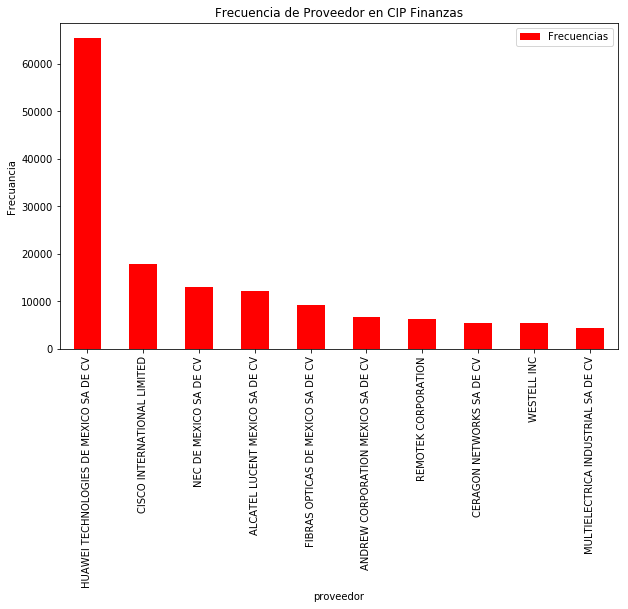

### Axity - AT&T.
# Exploratory Data Analysis
## Ciclo de vida de elementos de CIP Finanzas

## Descripción
Analizaremos los datos de las fuentes de inventarios de AT&T con un tratamiento estadístico descriptivo para hacer el tracking del ciclo de vida de los elementos de red.
        Este EDA contiene información general para la fuente de CIP Finanzas.

* **CIP FINANZAS**

Primero cargamos las librerías necesarias.

#### Conectando al Datalake


```python
import os
os.environ['JAVA_HOME'] = '/usr/java/jdk1.8.0_162'
os.environ['SPARK_HOME'] = '/opt/cloudera/parcels/CDH-6.2.0-1.cdh6.2.0.p0.967373/lib/spark'
import findspark
findspark.init()
from pyspark import SparkContext, SparkConf
from pyspark.sql import SparkSession
from pyspark.sql.types import *
from pyspark.sql import HiveContext
```


```python
conf = SparkConf().setAppName('EDA_CIP_Finanzas')  \
    .setMaster('yarn').set("spark.yarn.queue","root.eda") 
spark = SparkSession.builder.config(conf=conf).getOrCreate()
sc = spark.sparkContext
sqlContext = HiveContext(sc)
```


```python
import pandas as pd
import numpy as np
import re
import matplotlib.pyplot as plt
from PIL import Image
import nltk
import pandasql

from nltk.corpus import stopwords
from nltk.tokenize import sent_tokenize
from nltk.probability import FreqDist
from nltk.tokenize import word_tokenize
from fuzzywuzzy import fuzz, process

from bokeh.io import show, output_file, output_notebook
from bokeh.plotting import figure
from bokeh.models import ColumnDataSource
from bokeh.palettes import PuRd3, viridis, Blues, plasma, Set1
from bokeh.transform import cumsum
from bokeh.palettes import Category20c, Category20_11, Category20c_20, PuRd3, viridis, Blues, plasma, Set1, Category20_17
output_notebook()
%matplotlib inline
```


    <div class="bk-root">
        <a href="https://bokeh.pydata.org" target="_blank" class="bk-logo bk-logo-small bk-logo-notebook"></a>
        <span id="e26437ef-21e0-444d-9c8e-0a54ae9cc2b7">Loading BokehJS ...</span>
    </div>


```python
import re
from pyspark.sql.functions import udf ,col
from pyspark.sql.types import IntegerType
```

### Recolección de los datos: 

Los datos con los que se trabajan a lo largo del EDA corresponden al periódo de Octubre-2019 de la tabla ```default.tx_finance_cip```.

*IMPORTANTE*: Si se requieren ver datos de otro periódo, se debe cambiar el filtro ```month = <periodo-a-ejecutar>``` en la siguiente celda:


```python
df=spark.sql("SELECT prefix_1_id as id, prefix_2_origen as origen, prefix_3_activo as activo, prefix_10_proyecto as proyecto, prefix_11_nombreproyecto as nombreproyecto, prefix_13_descripcin as descripcion, prefix_16_articulo as articulo, prefix_19_mxn as mxn, prefix_20_usd as usd, prefix_23_ubicacinconfirmada as ubicacinconfirmada, prefix_24_tipoubicacin as tipoubicacin, prefix_28_mesdeingreso as mesdeingreso, prefix_40_ordendecompra as ordendecompra, prefix_41_proveedor as proveedor, prefix_42_nmeroetiqueta as etiqueta, prefix_43_nmeroserie as serie, prefix_49_ubicado as ubicado, prefix_50_noubicado as noubicado, prefix_57_idsitio as idsitio, prefix_58_idoracle as idoracle, prefix_59_nombredelsitio as nombdredelsitio, prefix_63_idpm as idpm, prefix_69_director as director, prefix_76_avp as avp, prefix_79_idsitio as id_sitio, filedate, month, year FROM tx_finance_cip WHERE year = 2019 and month = 10 and day = 1")
```

Hemos recolectado los campos a analizar de la fuente CIP Finanzas.

Después de recolectado los datos, se le agrega una columna la cual nos ayudará para limpieza de número de serie de acuerdo con las reglas
proporcionadas por la tabla ```inventario.cat_regex_cleanup```.


```python
def validate_rule(string):
    
    search_list=[" ",'!','%','$','¡',u'¿','~','#','Ñ',"Ã","Ń","Ë","ó",'Ë','*','?',"ILEGIBLE", "VICIBLE","VISIBLE","INCOMPLETO"]
    str_temp = str(string)
    if str_temp.upper() == "BORRADO":
      return 1
    elif len(str_temp) < 6:
      return 1
    elif any(ext in str_temp.upper()for ext in search_list):
      return 1
    else:
      return 0
```


```python
validate_rule_udf = udf(validate_rule, IntegerType())
df_serie = df.withColumn("serie_cleaned",validate_rule_udf(col("serie")))
```


```python
df = df_serie.toPandas()
```

Una muestra de la fuente CIP Finanzas


```python
df.head(5)
```


<div>
<table border="1" class="dataframe">
  <thead>
    <tr style="text-align: right;">
      <th></th>
      <th>id</th>
      <th>origen</th>
      <th>activo</th>
      <th>proyecto</th>
      <th>nombreproyecto</th>
      <th>descripcion</th>
      <th>articulo</th>
      <th>mxn</th>
      <th>usd</th>
      <th>ubicacinconfirmada</th>
      <th>...</th>
      <th>idoracle</th>
      <th>nombdredelsitio</th>
      <th>idpm</th>
      <th>director</th>
      <th>avp</th>
      <th>id_sitio</th>
      <th>filedate</th>
      <th>month</th>
      <th>year</th>
      <th>serie_cleaned</th>
    </tr>
  </thead>
  <tbody>
    <tr>
      <th>0</th>
      <td>1</td>
      <td>Módulo</td>
      <td>1398036</td>
      <td>10MWL00400</td>
      <td>NA</td>
      <td>RTN 605 SYSTEM 3*FE+1*GE+16*E1+2*IF IDU UNIT (...</td>
      <td>W.0913619</td>
      <td>4,398.39</td>
      <td>230.75</td>
      <td>ALPMX1</td>
      <td>...</td>
      <td>ALPMX1</td>
      <td>ALMACEN</td>
      <td>-</td>
      <td>-</td>
      <td>HECTOR VAZQUEZ</td>
      <td>ALPMX1</td>
      <td>20191001</td>
      <td>10</td>
      <td>2019</td>
      <td>0</td>
    </tr>
    <tr>
      <th>1</th>
      <td>12</td>
      <td>Módulo</td>
      <td>2982105</td>
      <td>PRUEBAFUS1</td>
      <td>PRUEBAFUS1</td>
      <td>HW CAPACITY EXPANSION (EPB1) - EVOC 8200</td>
      <td>W.0810100</td>
      <td>1.00</td>
      <td>0.05</td>
      <td>013MSO</td>
      <td>...</td>
      <td>013MSO</td>
      <td>MSO 3G TLALNEPANTLA</td>
      <td>-</td>
      <td>-</td>
      <td>PRE ATT</td>
      <td>MSOMEX01</td>
      <td>20191001</td>
      <td>10</td>
      <td>2019</td>
      <td>0</td>
    </tr>
    <tr>
      <th>2</th>
      <td>13</td>
      <td>Módulo</td>
      <td>2982106</td>
      <td>PRUEBAFUS1</td>
      <td>PRUEBAFUS1</td>
      <td>BYB501 OVER HEAD EQUIPMENT</td>
      <td>W.0810098</td>
      <td>1.00</td>
      <td>0.05</td>
      <td>013MSO</td>
      <td>...</td>
      <td>013MSO</td>
      <td>MSO 3G TLALNEPANTLA</td>
      <td>-</td>
      <td>-</td>
      <td>PRE ATT</td>
      <td>MSOMEX01</td>
      <td>20191001</td>
      <td>10</td>
      <td>2019</td>
      <td>1</td>
    </tr>
    <tr>
      <th>3</th>
      <td>14</td>
      <td>Módulo</td>
      <td>2983146</td>
      <td>16GACA9852</td>
      <td>MW LINKS - BATCH 13</td>
      <td>RTN980 ASSEMBLY CHASSIS</td>
      <td>W.4501596</td>
      <td>14,527.01</td>
      <td>762.11</td>
      <td>ALPMX1</td>
      <td>...</td>
      <td>ALPMX1</td>
      <td>ALMACEN</td>
      <td></td>
      <td>NICOLE RODRIGUEZ</td>
      <td>HECTOR VAZQUEZ</td>
      <td>ALPMX1</td>
      <td>20191001</td>
      <td>10</td>
      <td>2019</td>
      <td>0</td>
    </tr>
    <tr>
      <th>4</th>
      <td>15</td>
      <td>Módulo</td>
      <td>2983150</td>
      <td>16GACA9852</td>
      <td>MW LINKS - BATCH 13</td>
      <td>RTN980 ASSEMBLY CHASSIS</td>
      <td>W.4501596</td>
      <td>14,527.01</td>
      <td>762.11</td>
      <td>ALPMX1</td>
      <td>...</td>
      <td>ALPMX1</td>
      <td>ALMACEN</td>
      <td></td>
      <td>NICOLE RODRIGUEZ</td>
      <td>HECTOR VAZQUEZ</td>
      <td>ALPMX1</td>
      <td>20191001</td>
      <td>10</td>
      <td>2019</td>
      <td>0</td>
    </tr>
  </tbody>
</table>
<p>5 rows × 29 columns</p>
</div>


### Diccionario de datos.
A continuación se enlistan los campos de la fuente con una breve descripción de negocio.  
* **ID**: identificador interno.
* **Origen**: identifica el origen rdel registro, puede ser Módulo, Manuales o PA.
* **Activo**: número de activo interno.
* **Legal Entity**: clave de la entidad legal.
* **Libro**: libro contable del activo.
* **Consec. Papel de Trabajo**: id consecutivo del archivo origen.
* **No. Transacción**: número de transacción.
* **No. Factura**: número de factura.
* **Categoria**: categoría del activo.
* **Proyecto**: código de proyecto.
* **Nombre Proyecto**: nombre de proyecto.
* **Tarea**: clave de tarea
* **Descripción**: descripción del artículo
* **UNITS_ASSIGNED**: número de unidades, la suma de esta columna por cada activo resulta igual al valor de la columna UNIDADES.
* **UNIDADES**: total de unidades por activo, se repite el valor para cada registro de un mismo activo.
* **Articulo**: identificador de oracle.
* **Cuenta**: número de cuenta.
* **Sub_Cta**: número de subcuenta.
* **MXN**: cantidad en pesos.
* **USD**: cantidad en dólares.
* **TC**: tipo de cambio.
* **/000**: cantidad en dólares en miles, es el resultado de dividir la columna USD entre 1,000.
* **Ubicación confirmada**: última ubicación del elemento confirmada.
* **Tipo Ubicación**: clasifica el activo si es elemento de red o no.
* **Tipo GRAFICA**: campo vacío.
* **Tipo de Ubicación resum GRAFICA**: tipo de clasificación manual de la ubicación.
* **Mes de ingreso**: mes de ingreso del elemento.
* **Mes**: periodo del archivo, siempre indica el último día natural del mes.
* **Tec**: subclasificación del elemento por tipo de tecnología.
* **Tipo**: subclasificación del elemento por tipo de tecnología.
* **Ref**: por definir.
* **Cons/Pol saldo cuentas**: por definir.
* **Concepto**: por definir.
* **Year**: año de ingreso al CIP.
* **Días**: número de días que han transcurrido entre la fecha de ingreso a CIP (columna Mes de ingreso) y la fecha del archivo (columna Mes).
* **DAYS>**: clasificación de la columna Días, identifica si el valor es menor a 180, entre 180 y 361 o mayor a 361.
* **Parametros Days**: por definir.
* **Tipo Cuenta**: contiene la constante "CIP".
* **Orden de Compra**: número de orden de compra.
* **Proveedor**: proveedor del elemento.
* **Número Etiqueta**: etiqueta del elemento.
* **Número Serie**: número de serie del elemento.
* **obsv**: comentarios manuales sobre el elemento.
* **Valid**: no contiene datos.
* **Póliza CAP**: no contiene datos.
* **TC 20**: conversión de la columna MXN a dólares, calcula un tipo de cambio de $20 por cada dólar.
* **TC18**: conversión de la columna MXN a dólares, calcula un tipo de cambio de $18 por cada dólar.
* **Ubicado**: contiene la conversión de la columna MXN a dólares, calcula un tipo de cambio de $20 para elementos ubicados, no coincide con la bandera de ubicación confirmada..
* **No Ubicado**: no contiene valores.
* **&&&**: por definir.
* **AREA OK**: área del elemento.
* **CATEGORIA_BUDGET1_JC**: categoría del elemento en el presupuesto.
* **CATEGORIA_BUDGET2_JC**: subcategoría del elemento en el presupuesto.
* **Categoria Mast Plann**: categoría del elemento en el master planning.
* **Categoria Master CIP Budget**: categoría del elemento en CIP.
* **ID SITIO**: identificador del sitio.
* **ID ORACLE**: identificador del sitio de oracle.
* **NOMBRE DEL SITIO**: nombre o  tipo del sitio donde se encuentra  el elemento.
* **SUB AREA**: sub area.
* **UBICACION CONFIRMADA**: bandera que indica si la ubicación del elemento ha sido confirmada.
* **IDPM**: por definir.
* **PM**: nombre del project manager del proyecto.
* **PROJECT PM**: por definir.
* **ID_PROGRAMA**: por definir.
* **NOMBRE PROGRAMA**: por definir.
* **AREA OK**: por definir.
* **Solicitante**: nombre del solicitante.
* **Director**: nombre del director.
* **Responsable**: nombre del responsable.
* **Nota al comprador**: por definir.
* **Categoria**: categoría homologada del elemento.
* **Sub_categoria**: subcategoría homologada del elemento.
* **AREA HOMOLOGADA**: nombre del área (descripción homologada).
* **Macro**: por definir.
* **Clasificación**: contiene una bandera que indica si el elemento es de tipo Network.
* **Disponibles German Luna**: campop vacío, Germán Luna es el nombre dle responsable del archivo.
* **Control de Cambios en Proceso**: por definir.
* **filedate**: Fecha de carga del archivo.
* **filename**: Nombre del archivo cargado.
* **hash_id**: Identificador único Hash.
* **source_id**: Fuente de archivo.
* **registry_state**: Timestamp de carga.
* **datasetname**: Nombre del archivo.
* **timestamp**: Fecha de carga.
* **transaction_status**: Estatus de carga.
* **year**: Año del archivo.
* **month**: Mes del archivo.
* **day**: Día del archivo.
* **serie_cleaned**: Bandera para mostrar si el número de serie contiene un dato que no corresponde a un número de serie.

### 2. Descripción de las fuentes.
En este apartado se hará una descripción a detalle de las fuentes para una mejor comprensión de los datos. Por cada fuente se mostrarán los tipos de datos, tamaño de la fuente, es decir, su dimensionalidad y una estadística descriptiva, en ese orden.


```python
campos=df.columns
print('Columnas de la fuente CIP Finanzas son: ',list(campos))
pd.DataFrame(df.dtypes,columns=['Tipo de objeto CIP Finanzas'])
```

    ('Columnas de la fuente CIP Finanzas son: ', ['id', 'origen', 'activo', 'proyecto', 'nombreproyecto', 'descripcion', 'articulo', 'mxn', 'usd', 'ubicacinconfirmada', 'tipoubicacin', 'mesdeingreso', 'ordendecompra', 'proveedor', 'etiqueta', 'serie', 'ubicado', 'noubicado', 'idsitio', 'idoracle', 'nombdredelsitio', 'idpm', 'director', 'avp', 'id_sitio', 'filedate', 'month', 'year', 'serie_cleaned'])


<div>
<table border="1" class="dataframe">
  <thead>
    <tr style="text-align: right;">
      <th></th>
      <th>Tipo de objeto CIP Finanzas</th>
    </tr>
  </thead>
  <tbody>
    <tr>
      <th>id</th>
      <td>object</td>
    </tr>
    <tr>
      <th>origen</th>
      <td>object</td>
    </tr>
    <tr>
      <th>activo</th>
      <td>object</td>
    </tr>
    <tr>
      <th>proyecto</th>
      <td>object</td>
    </tr>
    <tr>
      <th>nombreproyecto</th>
      <td>object</td>
    </tr>
    <tr>
      <th>descripcion</th>
      <td>object</td>
    </tr>
    <tr>
      <th>articulo</th>
      <td>object</td>
    </tr>
    <tr>
      <th>mxn</th>
      <td>object</td>
    </tr>
    <tr>
      <th>usd</th>
      <td>object</td>
    </tr>
    <tr>
      <th>ubicacinconfirmada</th>
      <td>object</td>
    </tr>
    <tr>
      <th>tipoubicacin</th>
      <td>object</td>
    </tr>
    <tr>
      <th>mesdeingreso</th>
      <td>object</td>
    </tr>
    <tr>
      <th>ordendecompra</th>
      <td>object</td>
    </tr>
    <tr>
      <th>proveedor</th>
      <td>object</td>
    </tr>
    <tr>
      <th>etiqueta</th>
      <td>object</td>
    </tr>
    <tr>
      <th>serie</th>
      <td>object</td>
    </tr>
    <tr>
      <th>ubicado</th>
      <td>object</td>
    </tr>
    <tr>
      <th>noubicado</th>
      <td>object</td>
    </tr>
    <tr>
      <th>idsitio</th>
      <td>object</td>
    </tr>
    <tr>
      <th>idoracle</th>
      <td>object</td>
    </tr>
    <tr>
      <th>nombdredelsitio</th>
      <td>object</td>
    </tr>
    <tr>
      <th>idpm</th>
      <td>object</td>
    </tr>
    <tr>
      <th>director</th>
      <td>object</td>
    </tr>
    <tr>
      <th>avp</th>
      <td>object</td>
    </tr>
    <tr>
      <th>id_sitio</th>
      <td>object</td>
    </tr>
    <tr>
      <th>filedate</th>
      <td>int64</td>
    </tr>
    <tr>
      <th>month</th>
      <td>int32</td>
    </tr>
    <tr>
      <th>year</th>
      <td>int32</td>
    </tr>
    <tr>
      <th>serie_cleaned</th>
      <td>int32</td>
    </tr>
  </tbody>
</table>
</div>


```python
print('renglones = ',df.shape[0],' columnas = ',df.shape[1])
```

    ('renglones = ', 203210, ' columnas = ', 29)


```python
#Pasamos las columnas que queremos ver en nuestro describe:
NOrelevantes=['id', 'origen', 'mesdeingreso', 'ubicado',
              'noubicado', 'idpm', 'director',
              'avp', 'id_sitio', 'filedate', 'year', 'month', 'day']

relevantes=[v for v in df.columns if v not in NOrelevantes]

df[relevantes].describe(include='all')
```


<div>
<table border="1" class="dataframe">
  <thead>
    <tr style="text-align: right;">
      <th></th>
      <th>activo</th>
      <th>proyecto</th>
      <th>nombreproyecto</th>
      <th>descripcion</th>
      <th>articulo</th>
      <th>mxn</th>
      <th>usd</th>
      <th>ubicacinconfirmada</th>
      <th>tipoubicacin</th>
      <th>ordendecompra</th>
      <th>proveedor</th>
      <th>etiqueta</th>
      <th>serie</th>
      <th>idsitio</th>
      <th>idoracle</th>
      <th>nombdredelsitio</th>
      <th>serie_cleaned</th>
    </tr>
  </thead>
  <tbody>
    <tr>
      <th>count</th>
      <td>203210</td>
      <td>203210</td>
      <td>203210</td>
      <td>203210</td>
      <td>203210</td>
      <td>203210</td>
      <td>203210</td>
      <td>203210</td>
      <td>203210</td>
      <td>203210</td>
      <td>203210</td>
      <td>203210</td>
      <td>203210</td>
      <td>203210</td>
      <td>203210</td>
      <td>203210</td>
      <td>203210.000000</td>
    </tr>
    <tr>
      <th>unique</th>
      <td>142679</td>
      <td>807</td>
      <td>802</td>
      <td>5570</td>
      <td>3948</td>
      <td>15844</td>
      <td>14865</td>
      <td>7917</td>
      <td>2</td>
      <td>2282</td>
      <td>271</td>
      <td>92697</td>
      <td>111967</td>
      <td>7583</td>
      <td>7917</td>
      <td>6370</td>
      <td>NaN</td>
    </tr>
    <tr>
      <th>top</th>
      <td>-</td>
      <td>19GACA0102</td>
      <td>CAPACITY EXPANSION SITES</td>
      <td>SFP- GIGE BASE-T RJ45 R6/6 DDM-40/85C</td>
      <td>W.9049028</td>
      <td>847.10</td>
      <td>44.44</td>
      <td>ALPMX1</td>
      <td>Network</td>
      <td>1201903853</td>
      <td>HUAWEI TECHNOLOGIES DE MEXICO SA DE CV</td>
      <td></td>
      <td></td>
      <td>ALPMX1</td>
      <td>ALPMX1</td>
      <td>ALMACEN</td>
      <td>NaN</td>
    </tr>
    <tr>
      <th>freq</th>
      <td>19481</td>
      <td>13790</td>
      <td>13790</td>
      <td>10710</td>
      <td>10710</td>
      <td>5287</td>
      <td>5288</td>
      <td>110410</td>
      <td>203005</td>
      <td>12026</td>
      <td>65355</td>
      <td>80155</td>
      <td>59370</td>
      <td>110394</td>
      <td>110394</td>
      <td>148910</td>
      <td>NaN</td>
    </tr>
    <tr>
      <th>mean</th>
      <td>NaN</td>
      <td>NaN</td>
      <td>NaN</td>
      <td>NaN</td>
      <td>NaN</td>
      <td>NaN</td>
      <td>NaN</td>
      <td>NaN</td>
      <td>NaN</td>
      <td>NaN</td>
      <td>NaN</td>
      <td>NaN</td>
      <td>NaN</td>
      <td>NaN</td>
      <td>NaN</td>
      <td>NaN</td>
      <td>0.325225</td>
    </tr>
    <tr>
      <th>std</th>
      <td>NaN</td>
      <td>NaN</td>
      <td>NaN</td>
      <td>NaN</td>
      <td>NaN</td>
      <td>NaN</td>
      <td>NaN</td>
      <td>NaN</td>
      <td>NaN</td>
      <td>NaN</td>
      <td>NaN</td>
      <td>NaN</td>
      <td>NaN</td>
      <td>NaN</td>
      <td>NaN</td>
      <td>NaN</td>
      <td>0.468460</td>
    </tr>
    <tr>
      <th>min</th>
      <td>NaN</td>
      <td>NaN</td>
      <td>NaN</td>
      <td>NaN</td>
      <td>NaN</td>
      <td>NaN</td>
      <td>NaN</td>
      <td>NaN</td>
      <td>NaN</td>
      <td>NaN</td>
      <td>NaN</td>
      <td>NaN</td>
      <td>NaN</td>
      <td>NaN</td>
      <td>NaN</td>
      <td>NaN</td>
      <td>0.000000</td>
    </tr>
    <tr>
      <th>25%</th>
      <td>NaN</td>
      <td>NaN</td>
      <td>NaN</td>
      <td>NaN</td>
      <td>NaN</td>
      <td>NaN</td>
      <td>NaN</td>
      <td>NaN</td>
      <td>NaN</td>
      <td>NaN</td>
      <td>NaN</td>
      <td>NaN</td>
      <td>NaN</td>
      <td>NaN</td>
      <td>NaN</td>
      <td>NaN</td>
      <td>0.000000</td>
    </tr>
    <tr>
      <th>50%</th>
      <td>NaN</td>
      <td>NaN</td>
      <td>NaN</td>
      <td>NaN</td>
      <td>NaN</td>
      <td>NaN</td>
      <td>NaN</td>
      <td>NaN</td>
      <td>NaN</td>
      <td>NaN</td>
      <td>NaN</td>
      <td>NaN</td>
      <td>NaN</td>
      <td>NaN</td>
      <td>NaN</td>
      <td>NaN</td>
      <td>0.000000</td>
    </tr>
    <tr>
      <th>75%</th>
      <td>NaN</td>
      <td>NaN</td>
      <td>NaN</td>
      <td>NaN</td>
      <td>NaN</td>
      <td>NaN</td>
      <td>NaN</td>
      <td>NaN</td>
      <td>NaN</td>
      <td>NaN</td>
      <td>NaN</td>
      <td>NaN</td>
      <td>NaN</td>
      <td>NaN</td>
      <td>NaN</td>
      <td>NaN</td>
      <td>1.000000</td>
    </tr>
    <tr>
      <th>max</th>
      <td>NaN</td>
      <td>NaN</td>
      <td>NaN</td>
      <td>NaN</td>
      <td>NaN</td>
      <td>NaN</td>
      <td>NaN</td>
      <td>NaN</td>
      <td>NaN</td>
      <td>NaN</td>
      <td>NaN</td>
      <td>NaN</td>
      <td>NaN</td>
      <td>NaN</td>
      <td>NaN</td>
      <td>NaN</td>
      <td>1.000000</td>
    </tr>
  </tbody>
</table>
</div>


#### Haremos anotaciones sobre lo que se puede observar de la tabla describe:

El total de elementos que existen para la fuente son **203,310** registros.
* **etiquetas(activos) únicas**: 92,697
* **etiquetas(activos) duplicadas**: 110,613
* **números de serie únicos**: 111,967
* **números de serie duplicados**: 91,343

#### Se proponen catálogos derivados de la fuente CIP Finanzas con los siguientes campos:
    
* **Descripción**: pequeña descripción del elemento o artículo en CIP Finanzas.  
* **Proveedor**: responsable de entrega de material o elementos.

Estos catálogos nos ayudarán a mapear todos los diferentes proveedores y a clasificar de manera general los proyectos que se encuentran en CIP.


### 3. Exploración de los datos.
De acuerdo al análisis anterior, procedemos a hacer una exploración de los datos con gráficas, de manera particular nos enfocaremos en los catálogos.

#### Para empezar, se hará una limpieza general a los datos:


```python
df.id.replace('',np.NaN,inplace=True)
df.origen.replace('',np.NaN,inplace=True)
df.activo.replace('',np.NaN,inplace=True)
df.activo.replace('-',np.NaN,inplace=True)
df.proyecto.replace('',np.NaN,inplace=True)
df.nombreproyecto.replace('',np.NaN,inplace=True)
df.descripcion.replace('',np.NaN,inplace=True)
df.articulo.replace('',np.NaN,inplace=True)
df.articulo.replace('-',np.NaN,inplace=True)
df.mxn.replace('',np.NaN,inplace=True)
df.usd.replace('',np.NaN,inplace=True)
df.ubicacinconfirmada.replace('',np.NaN,inplace=True)
df.tipoubicacin.replace('',np.NaN,inplace=True)
df.mesdeingreso.replace('',np.NaN,inplace=True)
df.ordendecompra.replace('',np.NaN,inplace=True)
df.proveedor.replace('',np.NaN,inplace=True)
df.etiqueta.replace('',np.NaN,inplace=True)
df.etiqueta.replace('-',np.NaN,inplace=True)
df.etiqueta.replace('N/A',np.NaN,inplace=True)
df.serie.replace('',np.NaN,inplace=True)
df.serie.replace('-',np.NaN,inplace=True)
df.serie.replace('N/A',np.NaN,inplace=True)
df.ubicado.replace('',np.NaN,inplace=True)
df.noubicado.replace('',np.NaN,inplace=True)
df.idsitio.replace('',np.NaN,inplace=True)
df.id_sitio.replace('',np.NaN,inplace=True)
df.filedate.replace('',np.NaN,inplace=True)
df.month.replace('',np.NaN,inplace=True)
df.year.replace('',np.NaN,inplace=True)
```

Podemos realizar un histograma con los datos que utilizariamos para el catálogo de proveedores, primero debemos normalizar:


```python
ind=list(range(0,10))
principales=pd.DataFrame(df.proveedor.value_counts()[:10])
proveedor=principales.index
proveedor=pd.DataFrame(proveedor,index=ind)
proveedor.columns=['proveedor']
principales.index=ind
principales.columns=['Frecuencias']

principales=pd.concat([proveedor,principales],axis=1)

medios=df.proveedor.value_counts()[10:70].sum()
Otros=df.proveedor.value_counts()[70:].sum()

Medios=pd.DataFrame({'proveedor':'Medios','Frecuencias':medios},index=[0])
Otros=pd.DataFrame({'proveedor':'Otros','Frecuencias':Otros},index=[0])

Total=pd.concat([principales,Medios,Otros])
Total.reset_index(inplace=True,drop=True)
Total
```

    /opt/cloudera/parcels/Anaconda-5.3.1/lib/python2.7/site-packages/ipykernel_launcher.py:17: FutureWarning: Sorting because non-concatenation axis is not aligned. A future version
    of pandas will change to not sort by default.
    
    To accept the future behavior, pass 'sort=False'.
    
    To retain the current behavior and silence the warning, pass 'sort=True'.
    


<div>
<table border="1" class="dataframe">
  <thead>
    <tr style="text-align: right;">
      <th></th>
      <th>Frecuencias</th>
      <th>proveedor</th>
    </tr>
  </thead>
  <tbody>
    <tr>
      <th>0</th>
      <td>65355</td>
      <td>HUAWEI TECHNOLOGIES DE MEXICO SA DE CV</td>
    </tr>
    <tr>
      <th>1</th>
      <td>17855</td>
      <td>CISCO INTERNATIONAL LIMITED</td>
    </tr>
    <tr>
      <th>2</th>
      <td>13038</td>
      <td>NEC DE MEXICO SA DE CV</td>
    </tr>
    <tr>
      <th>3</th>
      <td>12287</td>
      <td>ALCATEL LUCENT MEXICO SA DE CV</td>
    </tr>
    <tr>
      <th>4</th>
      <td>9218</td>
      <td>FIBRAS OPTICAS DE MEXICO SA DE CV</td>
    </tr>
    <tr>
      <th>5</th>
      <td>6784</td>
      <td>ANDREW CORPORATION MEXICO SA DE CV</td>
    </tr>
    <tr>
      <th>6</th>
      <td>6243</td>
      <td>REMOTEK CORPORATION</td>
    </tr>
    <tr>
      <th>7</th>
      <td>5453</td>
      <td>CERAGON NETWORKS SA DE CV</td>
    </tr>
    <tr>
      <th>8</th>
      <td>5394</td>
      <td>WESTELL INC</td>
    </tr>
    <tr>
      <th>9</th>
      <td>4339</td>
      <td>MULTIELECTRICA INDUSTRIAL SA DE CV</td>
    </tr>
    <tr>
      <th>10</th>
      <td>51404</td>
      <td>Medios</td>
    </tr>
    <tr>
      <th>11</th>
      <td>5840</td>
      <td>Otros</td>
    </tr>
  </tbody>
</table>
</div>


Una vez normalizado, podemos ver el histograma con el proveedor mas frecuente en CIP Finanazas durante el mes de Octubre.


```python
principales_aux=principales.set_index('proveedor')
principales_aux.plot(kind='bar',figsize=(10,6),rot=90,colormap='rainbow_r')
plt.xlabel('proveedor')
plt.ylabel('Frecuancia')
plt.title('Frecuencia de Proveedor en CIP Finanzas')
```


    Text(0.5,1,'Frecuencia de Proveedor en CIP Finanzas')





Estas gráficas nos muestran que el proveedor que tiene mas participación en CIP Finanzas es **HUAWEI TECHNOLOGIES DE MEXICO SA DE CV**.

#### Visualización de los datos de trazabilidad: 


```python
pd.DataFrame(df.serie.value_counts()[:15])
```


<div>
<table border="1" class="dataframe">
  <thead>
    <tr style="text-align: right;">
      <th></th>
      <th>serie</th>
    </tr>
  </thead>
  <tbody>
    <tr>
      <th>16US461891688</th>
      <td>4</td>
    </tr>
    <tr>
      <th>64054</th>
      <td>3</td>
    </tr>
    <tr>
      <th>15US462024519</th>
      <td>3</td>
    </tr>
    <tr>
      <th>15US462024513</th>
      <td>3</td>
    </tr>
    <tr>
      <th>63962</th>
      <td>3</td>
    </tr>
    <tr>
      <th>63971</th>
      <td>3</td>
    </tr>
    <tr>
      <th>63963</th>
      <td>3</td>
    </tr>
    <tr>
      <th>14US461269314</th>
      <td>3</td>
    </tr>
    <tr>
      <th>63964</th>
      <td>3</td>
    </tr>
    <tr>
      <th>13US461753647</th>
      <td>3</td>
    </tr>
    <tr>
      <th>63968</th>
      <td>3</td>
    </tr>
    <tr>
      <th>63969</th>
      <td>3</td>
    </tr>
    <tr>
      <th>63973</th>
      <td>3</td>
    </tr>
    <tr>
      <th>64010</th>
      <td>3</td>
    </tr>
    <tr>
      <th>64011</th>
      <td>3</td>
    </tr>
  </tbody>
</table>
</div>


```python
pd.DataFrame(df.etiqueta.value_counts()[:15])
```


<div>
<table border="1" class="dataframe">
  <thead>
    <tr style="text-align: right;">
      <th></th>
      <th>etiqueta</th>
    </tr>
  </thead>
  <tbody>
    <tr>
      <th>305921002</th>
      <td>30</td>
    </tr>
    <tr>
      <th>3G174950</th>
      <td>3</td>
    </tr>
    <tr>
      <th>3G228571</th>
      <td>3</td>
    </tr>
    <tr>
      <th>3G205637</th>
      <td>3</td>
    </tr>
    <tr>
      <th>VIR35421</th>
      <td>3</td>
    </tr>
    <tr>
      <th>00500279</th>
      <td>3</td>
    </tr>
    <tr>
      <th>3G231529</th>
      <td>3</td>
    </tr>
    <tr>
      <th>3G231610</th>
      <td>3</td>
    </tr>
    <tr>
      <th>3G147508</th>
      <td>3</td>
    </tr>
    <tr>
      <th>3G075086</th>
      <td>3</td>
    </tr>
    <tr>
      <th>3G228730</th>
      <td>3</td>
    </tr>
    <tr>
      <th>3G231600</th>
      <td>3</td>
    </tr>
    <tr>
      <th>3G228690</th>
      <td>3</td>
    </tr>
    <tr>
      <th>00672498</th>
      <td>3</td>
    </tr>
    <tr>
      <th>3G075087</th>
      <td>3</td>
    </tr>
  </tbody>
</table>
</div>


#### Es de interés haber observado los datos que se usaran para la trazabilidad. 
Podemos utilizar los siguientes queries como ejemplos para visualizar en HUE:
* Activo: `SELECT DISTINCT prefix_42_nmeroetiqueta FROM default.tx_finance_cip WHERE year = 2019 and month = 9 and day = 1;` 
* Serie: `SELECT DISTINCT prefix_43_nmeroserie FROM default.tx_finance_cip WHERE year = 2019 and month = 9 and day = 1;`

Exploramos la calidad de los datos y analizaremos las variables que necesitan tratamiento con la ayuda de visualizaciones y tablas.

#### Missings Values

Los missings values son los valores faltantes en el conjunto de datos que se refieren a aquellos campos que están vacíos o no tienen valores asignados, estos generalmente ocurren debido a errores de entrada de datos, fallas que ocurren con los procesos de recopilación de datos y, a menudo, al unir varias columnas de diferentes tablas encontramos una condición que conduce a valores faltantes. Existen numerosas formas de tratar los valores perdidos, los más fáciles son reemplazar el valor perdido con la media, la mediana, la moda o un valor constante (llegamos a un valor basado en el conocimiento del dominio) y otra alternativa es eliminar la entrada desde el conjunto de datos en sí.

Calculamos el porcentaje de NA's que tiene la fuente por columna:


```python
nas=df[relevantes].isna().sum()
porcentaje_nas=nas/df[relevantes].isna().count()

columnas=list(porcentaje_nas.keys())
counts_nas=list(porcentaje_nas.values)

#Para el siguiente comando, en el parámetro "color":
#Dependiendo el número de columnas se escoge un pallete, este debe ser cargado en la sección de librerías,
#Sólo se añade a la parte from bokeh.palettes import Category20c_20  colocando una ","
#http://docs.bokeh.org/en/1.3.2/docs/reference/palettes.html
#Se recomienda no poner más de 20 columnas. 
source=ColumnDataSource(dict(columnas=columnas, counts_nas=counts_nas, color=Category20_17))

p=figure(x_range=columnas, plot_height=300, plot_width=850, y_range=(0,1), title='Porcentaje de NAs por columna')
p.vbar(x='columnas',top='counts_nas',width=.7, color='color', legend='columnas', source=source)

p.xgrid.grid_line_color = None
p.legend.orientation = "horizontal"
p.legend.location = "top_center"

show(p)
pd.DataFrame(porcentaje_nas*100,columns=['Porcentaje de NAs'])
```


  <div class="bk-root" id="700e4cd6-0ff6-4e8c-a3c6-1d1c57d87643"></div>


<div>
<table border="1" class="dataframe">
  <thead>
    <tr style="text-align: right;">
      <th></th>
      <th>Porcentaje de NAs</th>
    </tr>
  </thead>
  <tbody>
    <tr>
      <th>activo</th>
      <td>9.586635</td>
    </tr>
    <tr>
      <th>proyecto</th>
      <td>0.000000</td>
    </tr>
    <tr>
      <th>nombreproyecto</th>
      <td>0.000000</td>
    </tr>
    <tr>
      <th>descripcion</th>
      <td>0.001968</td>
    </tr>
    <tr>
      <th>articulo</th>
      <td>0.173712</td>
    </tr>
    <tr>
      <th>mxn</th>
      <td>0.000000</td>
    </tr>
    <tr>
      <th>usd</th>
      <td>0.000000</td>
    </tr>
    <tr>
      <th>ubicacinconfirmada</th>
      <td>0.000000</td>
    </tr>
    <tr>
      <th>tipoubicacin</th>
      <td>0.000000</td>
    </tr>
    <tr>
      <th>ordendecompra</th>
      <td>0.000000</td>
    </tr>
    <tr>
      <th>proveedor</th>
      <td>0.000000</td>
    </tr>
    <tr>
      <th>etiqueta</th>
      <td>39.447862</td>
    </tr>
    <tr>
      <th>serie</th>
      <td>29.219527</td>
    </tr>
    <tr>
      <th>idsitio</th>
      <td>0.000000</td>
    </tr>
    <tr>
      <th>idoracle</th>
      <td>0.000000</td>
    </tr>
    <tr>
      <th>nombdredelsitio</th>
      <td>0.000000</td>
    </tr>
    <tr>
      <th>serie_cleaned</th>
      <td>0.000000</td>
    </tr>
  </tbody>
</table>
</div>


#### Visualización de datos NOT NULL: 


```python
notmiss=(1-porcentaje_nas)*100

columnas=list(notmiss.keys())
counts_nas=list(notmiss.values)

#Mismo aplica aquí para color
source=ColumnDataSource(dict(columnas=columnas, counts_nas=counts_nas, color=Category20_17))

p=figure(x_range=columnas, plot_height=300, plot_width=850, y_range=(0,100), 
         title='Porcentaje de NOT-NULL por columna')
p.vbar(x='columnas',top='counts_nas',width=.5, color='color', legend='columnas', source=source)

p.xgrid.grid_line_color = None
p.legend.orientation = "horizontal"
p.legend.location = "top_center"

show(p)

pd.DataFrame(notmiss,columns=['Porcentaje de NOT-NULL'])
```


  <div class="bk-root" id="16d43774-e2a7-4659-a873-43571f9aa484"></div>


<div>
<table border="1" class="dataframe">
  <thead>
    <tr style="text-align: right;">
      <th></th>
      <th>Porcentaje de NOT-NULL</th>
    </tr>
  </thead>
  <tbody>
    <tr>
      <th>activo</th>
      <td>90.413365</td>
    </tr>
    <tr>
      <th>proyecto</th>
      <td>100.000000</td>
    </tr>
    <tr>
      <th>nombreproyecto</th>
      <td>100.000000</td>
    </tr>
    <tr>
      <th>descripcion</th>
      <td>99.998032</td>
    </tr>
    <tr>
      <th>articulo</th>
      <td>99.826288</td>
    </tr>
    <tr>
      <th>mxn</th>
      <td>100.000000</td>
    </tr>
    <tr>
      <th>usd</th>
      <td>100.000000</td>
    </tr>
    <tr>
      <th>ubicacinconfirmada</th>
      <td>100.000000</td>
    </tr>
    <tr>
      <th>tipoubicacin</th>
      <td>100.000000</td>
    </tr>
    <tr>
      <th>ordendecompra</th>
      <td>100.000000</td>
    </tr>
    <tr>
      <th>proveedor</th>
      <td>100.000000</td>
    </tr>
    <tr>
      <th>etiqueta</th>
      <td>60.552138</td>
    </tr>
    <tr>
      <th>serie</th>
      <td>70.780473</td>
    </tr>
    <tr>
      <th>idsitio</th>
      <td>100.000000</td>
    </tr>
    <tr>
      <th>idoracle</th>
      <td>100.000000</td>
    </tr>
    <tr>
      <th>nombdredelsitio</th>
      <td>100.000000</td>
    </tr>
    <tr>
      <th>serie_cleaned</th>
      <td>100.000000</td>
    </tr>
  </tbody>
</table>
</div>


En la primer gráfica de barras se puede observar que **etiqueta** y **serie**, ambos campos llave para sacar indicadores y uniones con otras fuentes, tienen un porcentaje de *39.44%* y *29.21%* de nulos respectivamente, lo cual pueder provocar perdida de información cuando se quiera cruzar por alguno de estos campos.

### 5. Catálogos.

Para los catálogos de proyecto y descripción se utilizara un dataframe auxiliar:


```python
df_aux=df.loc[:,['proveedor','descripcion']]
```

A continuación se muestra la limpieza que se debe llevar a cabo para el campo proveedor y descripción:


```python
df_aux.proveedor=df_aux.proveedor.str.upper()
df_aux.descripcion=df_aux.descripcion.str.upper()
df_aux.replace(u'-',u'', regex=True, inplace=True)
df_aux.replace(u'Á',u'A', regex=True, inplace=True)
df_aux.replace(u'É',u'E', regex=True, inplace=True)
df_aux.replace(u'Í',u'I', regex=True, inplace=True)
df_aux.replace(u'Ó',u'O', regex=True, inplace=True)
df_aux.replace(u'Ú',u'U', regex=True, inplace=True)
df_aux.replace(u'/',u' ', regex=True, inplace=True)
df_aux.replace(u',',u' ', regex=True, inplace=True)
df_aux.replace(r'+',u' ',inplace=True)
df_aux.replace(u'"',u'', regex=True, inplace=True)
df_aux.replace(u'?',u' ', inplace=True)
df_aux.replace(u'¿',u' ', inplace=True)

df_aux.replace(u'NA',np.NaN, regex=True, inplace=True)

df_aux.proveedor.str.strip()
df_aux.descripcion.str.strip()
df_aux.dropna(inplace=True)
```


```python
df_aux.proveedor.replace('SA DE CV','',regex=True,inplace=True)
df_aux.proveedor.replace('INC','',regex=True,inplace=True)
df_aux.proveedor.replace('S DE RL DE CV','',regex=True,inplace=True)
df_aux.proveedor.replace('MEXICO','',regex=True,inplace=True)
df_aux.proveedor.replace('DE MEXICO','',regex=True,inplace=True)
df_aux.proveedor.replace('DE MEXICO SA DE CV','',regex=True,inplace=True)
df_aux.proveedor.replace('LLC','',regex=True,inplace=True)
df_aux.proveedor.replace('DE','',regex=True,inplace=True)
df_aux.proveedor=df_aux.proveedor.str.strip()
Proveedores=pd.DataFrame(df_aux.proveedor.unique(),columns=['Proveedores'])
```

#### Catálogo Proveedores:


```python
Proveedores.head(20)
```


<div>
<table border="1" class="dataframe">
  <thead>
    <tr style="text-align: right;">
      <th></th>
      <th>Proveedores</th>
    </tr>
  </thead>
  <tbody>
    <tr>
      <th>0</th>
      <td>HUAWEI TECHNOLOGIES</td>
    </tr>
    <tr>
      <th>1</th>
      <td>ERICSSON TELECOM</td>
    </tr>
    <tr>
      <th>2</th>
      <td>CERAGON NETWORKS</td>
    </tr>
    <tr>
      <th>3</th>
      <td>VIAVI SOLUTIONS</td>
    </tr>
    <tr>
      <th>4</th>
      <td>ADC</td>
    </tr>
    <tr>
      <th>5</th>
      <td>CT OPTICS</td>
    </tr>
    <tr>
      <th>6</th>
      <td>OPTRONICS</td>
    </tr>
    <tr>
      <th>7</th>
      <td>INSUMOS COMERCIALES  OCCINTE</td>
    </tr>
    <tr>
      <th>8</th>
      <td>ANDREW CORPORATION</td>
    </tr>
    <tr>
      <th>9</th>
      <td>PRYSMIAN CABLES Y SISTEMAS</td>
    </tr>
    <tr>
      <th>10</th>
      <td>LOCKEDUP LTD</td>
    </tr>
    <tr>
      <th>11</th>
      <td>SEOM SOLUTIONS</td>
    </tr>
    <tr>
      <th>12</th>
      <td>COMUNICACIONES Y SONIDO</td>
    </tr>
    <tr>
      <th>13</th>
      <td>GETRONICS</td>
    </tr>
    <tr>
      <th>14</th>
      <td>VERTIV</td>
    </tr>
    <tr>
      <th>15</th>
      <td>FIBRAS OPTICAS</td>
    </tr>
    <tr>
      <th>16</th>
      <td>ALESSO</td>
    </tr>
    <tr>
      <th>17</th>
      <td>GE POWER ELECTRONICS</td>
    </tr>
    <tr>
      <th>18</th>
      <td>ALCATEL LUCENT</td>
    </tr>
    <tr>
      <th>19</th>
      <td>REMOTEK CORPORATION</td>
    </tr>
  </tbody>
</table>
</div>


Limpieza especificada en el campo descripción:


```python
caracteres=['(EPB)','HW','BYB','RTN','V.','SC APC',';','UMPT','PCF','BBU','BBS',' IP','AMP','RRU'
           '.KW','SFP','SM','RF']
medidas=['GHZ','CM','TX','NM','GE','HZ',
         'GB','AWG','DB','MTZ','SERIES','CX','CD','RET','ACHO','RFC','HS',
        'HC','CDA','METROS']

df_aux.replace(u'0',u'', regex=True, inplace=True)
df_aux.replace(u'1',u'', regex=True, inplace=True)
df_aux.replace(u'2',u'', regex=True, inplace=True)
df_aux.replace(u'3',u'', regex=True, inplace=True)
df_aux.replace(u'4',u'', regex=True, inplace=True)
df_aux.replace(u'5',u'', regex=True, inplace=True)
df_aux.replace(u'6',u'', regex=True, inplace=True)
df_aux.replace(u'7',u'', regex=True, inplace=True)
df_aux.replace(u'8',u'', regex=True, inplace=True)
df_aux.replace(u'9',u'', regex=True, inplace=True)
df_aux.replace(caracteres,'',regex=True,inplace=True)
df_aux.replace(medidas,'',regex=True,inplace=True)
df_aux.descripcion=df_aux.descripcion.str.strip()
Desc=pd.DataFrame(df_aux.descripcion.unique(),columns=['Descripciones'])
Desc.dropna(inplace=True)
```


```python
text=Desc.Descripciones[0]
for v in range(1,Desc.shape[0]):
    text=text+Desc.Descripciones[v]
text1=word_tokenize(text)
```


```python
stop_words_esp=set(stopwords.words('spanish'))
stop_words_eng=set(stopwords.words('english'))
filtered_word=[w for w in text1 if w not in stop_words_esp]
filtered_word2=[w for w in filtered_word if w not in stop_words_eng]
fdist=FreqDist(filtered_word2)
fdist.most_common()
```


    [(u'(', 608),
     (u'DE', 552),
     (u')', 519),
     (u'M', 261),
     (u'.', 225),
     (u'CABLE', 175),
     (u':', 145),
     (u'LC', 144),
     (u'A', 144),
     (u'G', 132),
     (u'PARA', 122),
     (u'FOR', 109),
     (u'+', 108),
     (u'&', 108),
     (u'X', 99),
     (u'UNIT', 86),
     (u'E', 78),
     (u'POWER', 77),
     (u'C', 74),
     (u'KIT', 74),
     (u'CON', 73),
     (u'MM', 64),
     (u'BAND', 63),
     (u'UPC', 58),
     (u'W', 57),
     (u'TO', 55),
     (u'LOW', 54),
     (u'TRANSCEIR', 54),
     (u'WITH', 54),
     (u'N', 53),
     (u'DC', 50),
     (u'MODULE', 50),
     (u'F', 49),
     (u'B', 47),
     (u'DUPLEX', 46),
     (u'OPTICAL', 46),
     (u'.M', 44),
     (u'SUB', 43),
     (u'RACK', 40),
     (u'EN', 40),
     (u'S', 40),
     (u'HIGH', 39),
     (u'P', 38),
     (u'AND', 36),
     (u'SITE', 36),
     (u'TIPO', 36),
     (u'NEMA', 35),
     (u'CONTROL', 35),
     (u'SR', 35),
     (u'PIM', 35),
     (u'INSTALLATION', 35),
     (u'TENSION', 35),
     (u'PANEL', 34),
     (u'RJ', 34),
     (u'U', 34),
     (u'CORD', 33),
     (u'OHM', 33),
     (u'INTEACE', 32),
     (u'MONOMODO', 32),
     (u'SHIFTER', 32),
     (u'CABINET', 32),
     (u'PROCESSING', 32),
     (u'SINGLE', 31),
     (u'H', 30),
     (u'<', 30),
     (u'ODU', 29),
     (u'.MM', 28),
     (u'D', 28),
     (u'DUAL', 28),
     (u'OUTDOOR', 28),
     (u'PC', 28),
     (u'BASE', 27),
     (u'BOARD', 27),
     (u'Y', 26),
     (u'KW', 26),
     (u'CONECTOR', 25),
     (u'CORES', 25),
     (u'DISTRIBUCION', 25),
     (u'MODELO', 23),
     (u'MPO', 23),
     (u'MARCA', 23),
     (u'PORT', 23),
     (u'XMC', 23),
     (u'CONNECTOR', 23),
     (u'O', 23),
     (u'FT', 23),
     (u'CARD', 22),
     (u'OM', 22),
     (u'MALE', 22),
     (u'DLC', 21),
     (u'MODE', 21),
     (u'RO', 21),
     (u'SERNT', 21),
     (u'SYSTEM', 21),
     (u'CAP', 21),
     (u'SERCE', 21),
     (u'R', 21),
     (u'HILOS', 20),
     (u'JUMPER', 20),
     (u'MULTIMODE', 20),
     (u'FIBRA', 20),
     (u'FIBER', 20),
     (u'SWITCH', 20),
     (u'ELECTRICAL', 20),
     (u'CONECTORES', 20),
     (u'BATERIAS', 20),
     (u'K', 19),
     (u'METER', 19),
     (u'PATCH', 19),
     (u'PCS', 18),
     (u'CAPACIDAD', 18),
     (u'BOX', 18),
     (u'COLOR', 18),
     (u'FLEXIBLE', 18),
     (u'ACCESSORY', 18),
     (u'INCLUYE', 18),
     (u'FO', 18),
     (u'AWS', 17),
     (u'MIMO', 17),
     (u'CAT', 17),
     (u'PLANNING', 16),
     (u'UTP', 16),
     (u'NODE', 16),
     (u'Q', 16),
     (u'ETHERNET', 15),
     (u'FEMALE', 15),
     (u'.G', 15),
     (u'SPLITTER', 14),
     (u'DIN', 14),
     (u'LINK', 14),
     (u'READY', 14),
     (u'ASSEMBLY', 14),
     (u'PUERTOS', 14),
     (u'KM', 14),
     (u'EQUIPMENT', 14),
     (u'SHELF', 14),
     (u'PARTS', 14),
     (u'*', 14),
     (u'MINI', 14),
     (u'LR', 13),
     (u'OPTICA', 13),
     (u'HP', 13),
     (u'BARRAS', 13),
     (u'COPPER', 13),
     (u'COUPLER', 13),
     (u'FLEX', 13),
     (u'INT', 13),
     (u'SERR', 13),
     (u'FE', 13),
     (u'BLACK', 13),
     (u'MICROWA', 13),
     (u'CILINDRO', 12),
     (u'AISG', 12),
     (u'BATTERY', 12),
     (u'PDU', 12),
     (u'QDLOGIC', 12),
     (u'IHGASOLINK', 12),
     (u'INCH', 12),
     (u'ETSI', 12),
     (u'MOUNTING', 12),
     (u'UBR', 12),
     (u'CHASSIS', 12),
     (u'PT', 12),
     (u'T', 12),
     (u'UM', 12),
     (u'UL', 12),
     (u'MODEL', 12),
     (u'SAS', 11),
     (u'BASET', 11),
     (u'SER', 11),
     (u'MATERIALS', 11),
     (u'POR', 11),
     (u'COAXIAL', 11),
     (u'WAGUIDE', 11),
     (u'TABLERO', 11),
     (u'[', 11),
     (u'CATEGORY', 11),
     (u'RRU', 11),
     (u'CONFIGURATION', 11),
     (u'SUBAND', 11),
     (u'ENGLISH', 11),
     (u'REPEATER', 11),
     (u'TR', 11),
     (u'AH', 11),
     (u'OPERAC', 11),
     (u'BLUE', 11),
     (u'PS', 11),
     (u'DOUBLE', 11),
     (u'CE', 11),
     (u'SUPPORT', 10),
     (u'REAR', 10),
     (u'MM^', 10),
     (u'MMF', 10),
     (u']', 10),
     (u'IN', 10),
     (u'LTE', 10),
     (u'DESCARGA', 10),
     (u'L', 10),
     (u'MTS', 10),
     (u'FAN', 10),
     (u'PORTS', 10),
     (u'RISER', 10),
     (u'AC', 10),
     (u'ASE', 10),
     (u'SUBRACK', 10),
     (u'IDU', 10),
     (u'FREQUENCY', 9),
     (u'HPE', 9),
     (u'PACKA', 9),
     (u'MBPS', 9),
     (u'ADAPTER', 9),
     (u'AUTOSOPORTADO', 9),
     (u'RX', 9),
     (u'HYBRID', 9),
     (u'TYPE', 9),
     (u'I', 9),
     (u'TRUNK', 9),
     (u'MOUNT', 9),
     (u'CONTROLLER', 9),
     (u'PLUS', 9),
     (u'DISTRIBUTION', 9),
     (u'STORA', 9),
     (u'ANT', 9),
     (u'OF', 9),
     (u'RADIO', 9),
     (u'LINEA', 9),
     (u'FRONT', 9),
     (u'ALTA', 9),
     (u'MULTIMODO', 9),
     (u'FREE', 9),
     (u'COBRE', 9),
     (u'GROUNDING', 9),
     (u'@', 8),
     (u'BREAKER', 8),
     (u'CFP', 8),
     (u'POL', 8),
     (u'STRAIGHT', 8),
     (u'INPUT', 8),
     (u'TRANISSION', 8),
     (u'BANCO', 8),
     (u'WMA', 8),
     (u'LCLC', 8),
     (u'DM', 8),
     (u'LIC', 8),
     (u'MODULO', 8),
     (u'CABLES', 8),
     (u'INTERIOR', 8),
     (u'OPERACION', 8),
     (u'COOLING', 8),
     (u'NO', 8),
     (u'NF', 8),
     (u'ICS', 8),
     (u'RED', 8),
     (u'SP', 8),
     (u'SC', 8),
     (u'ACERO', 8),
     (u'LINE', 8),
     (u'~M', 8),
     (u'DDM', 8),
     (u'AUTOSOP', 8),
     (u'BASEBAND', 8),
     (u'INDOOR', 8),
     (u'EMERNCIA', 8),
     (u'MULTI', 8),
     (u'\u2510', 8),
     (u'SECO', 8),
     (u'~', 8),
     (u'MONTAJE', 8),
     (u'CPRI', 7),
     (u'SHIELDED', 7),
     (u'PANELBOARD', 7),
     (u'SPEED', 7),
     (u'FIBEEED', 7),
     (u'FRT', 7),
     (u'OPTICO', 7),
     (u'BRACKET', 7),
     (u'CL', 7),
     (u'PBR', 7),
     (u'MB', 7),
     (u'STM', 7),
     (u'ALUMINIUM', 7),
     (u'CAPAC', 7),
     (u'DL', 7),
     (u'EMPALME', 7),
     (u'RRUS', 7),
     (u'PNLB', 7),
     (u'CATE', 7),
     (u'UPCLC', 7),
     (u'GYFJH', 7),
     (u'COAX', 7),
     (u'PTOS', 7),
     (u'PLUG', 7),
     (u'PUSH', 7),
     (u'ER', 7),
     (u'FIBRAS', 7),
     (u'CCC', 7),
     (u'MAIN', 7),
     (u'AL', 7),
     (u'FC', 7),
     (u'ALL', 7),
     (u'INSULATION', 7),
     (u'REMOTE', 7),
     (u'*G', 7),
     (u'CONNECTORS', 7),
     (u'IEC', 7),
     (u'SIDE', 7),
     (u'GABINETE', 7),
     (u'SUPPLY', 6),
     (u'GD', 6),
     (u'HANR', 6),
     (u'MEGACENTRO', 6),
     (u'MOBILE', 6),
     (u'TIERRA', 6),
     (u'PAR', 6),
     (u'ETH', 6),
     (u'ACCESS', 6),
     (u'RTICAL', 6),
     (u'MJUMPER', 6),
     (u'HELIAX', 6),
     (u'CORE', 6),
     (u'WIRE', 6),
     (u'MT', 6),
     (u'TRONCAL', 6),
     (u'STD', 6),
     (u'DIGITAL', 6),
     (u'RU', 6),
     (u'PSSII', 6),
     (u'SLOT', 6),
     (u'YELLOW', 6),
     (u'FRAME', 6),
     (u'BYPASS', 6),
     (u'PER', 6),
     (u'SERINT', 6),
     (u'CIRCUITS', 6),
     (u'NITRO', 6),
     (u'NERAL', 6),
     (u'SX', 6),
     (u'CONSOLIDACION', 6),
     (u'FULL', 6),
     (u'WITHOUT', 6),
     (u'MMICROWA', 6),
     (u'OR', 6),
     (u'PRECISION', 6),
     (u'..', 6),
     (u'TRANSFERENCIA', 6),
     (u'WALL', 6),
     (u'CONDENSADORA', 6),
     (u'SUPER', 6),
     (u'WATER', 6),
     (u'LOWODU', 6),
     (u'LIEBERT', 6),
     (u'SUPELEX', 6),
     (u'HIGHODU', 6),
     (u'PULL', 6),
     (u'UPGRADE', 6),
     (u'COPPERCLAD', 6),
     (u'FUSE', 6),
     (u'MSO', 6),
     (u'COMPRESOR', 6),
     (u'LSZH', 6),
     (u'COMPATIBLE', 6),
     (u'IAGASOLINK', 6),
     (u'DOBLE', 5),
     (u'FUERZA', 5),
     (u'AUTOMATICA', 5),
     (u'ZR', 5),
     (u'ELEMENT', 5),
     (u'LB', 5),
     (u'LH', 5),
     (u'MSOINSTALACION', 5),
     (u'\xa2\u2510', 5),
     (u'APM', 5),
     (u'M~M', 5),
     (u'TRANSF', 5),
     (u'POS', 5),
     (u'GROUND', 5),
     (u'PAM', 5),
     (u'UNIRSAL', 5),
     (u'SUPPORTS', 5),
     (u'CU', 5),
     (u'BASIC', 5),
     (u'OUTPUT', 5),
     (u'CHILLED', 5),
     (u'DISK', 5),
     (u'PLANTA', 5),
     (u'MONITOR', 5),
     (u'POTENCIA', 5),
     (u'LISA', 5),
     (u'DF', 5),
     (u'DS', 5),
     (u'EAGLE', 5),
     (u'POSTES', 5),
     (u'COR', 5),
     (u'CASE', 5),
     (u'COMMUNICATIONS', 5),
     (u'INST', 5),
     (u'AISLAMIENTO', 5),
     (u'MOLDED', 5),
     (u'BREAKOUT', 5),
     (u'N+', 5),
     (u'SIMPLEX', 5),
     (u'PLANTAS', 5),
     (u'SE', 5),
     (u'EXTENSION', 5),
     (u'CHANNELS', 5),
     (u'AZUL', 5),
     (u'URN', 5),
     (u'\xa1', 5),
     (u'CIRCUIT', 5),
     (u'THROUGH', 5),
     (u'XX', 5),
     (u'ALIMENTACION', 5),
     (u'RPM', 5),
     (u'SHORT', 5),
     (u'AISLANTE', 5),
     (u'ILINE', 5),
     (u'PRINC', 5),
     (u'EXPANSION', 5),
     (u'AS', 5),
     (u'.KM', 5),
     (u'GREEN', 5),
     (u'UC', 5),
     (u'LBS', 5),
     (u'REMOTA', 5),
     (u"'", 5),
     (u'ANDREW', 5),
     (u'DOCMICROWA', 5),
     (u'CLOCK', 5),
     (u'INCLUDING', 5),
     (u'INTERRUPTOR', 5),
     (u'CISCO', 5),
     (u'LLA', 5),
     (u'ACCESORIOS', 5),
     (u'INCLUDE', 5),
     (u'SHIELDING', 5),
     (u'UP', 5),
     (u'UN', 5),
     (u'IZQUIERDO', 4),
     (u'AIR', 4),
     (u'GX', 4),
     (u'GI', 4),
     (u'COMBINER', 4),
     (u'ASSEMB', 4),
     (u'CONEXION', 4),
     (u'ELECTRIC', 4),
     (u'ELECTRICA', 4),
     (u'CONEXIONES', 4),
     (u'SAR', 4),
     (u'XEON', 4),
     (u'ASSY', 4),
     (u'CHANNEL', 4),
     (u'MPOH', 4),
     (u'.K', 4),
     (u'CLOUD', 4),
     (u'FABRICADO', 4),
     (u'CATEGORIA', 4),
     (u'TILT', 4),
     (u'G.D', 4),
     (u'R.E', 4),
     (u'ENCLOSURE', 4),
     (u'HUBBEL', 4),
     (u'FACTIB', 4),
     (u'IOM', 4),
     (u'PAIR', 4),
     (u'POLE', 4),
     (u'CRGN', 4),
     (u'MOD', 4),
     (u'SUP', 4),
     (u'HORIZONTAL', 4),
     (u'FIRMWARE', 4),
     (u'ARRAY', 4),
     (u'Z', 4),
     (u'OUT', 4),
     (u'LOGIC', 4),
     (u'DINFEMALE', 4),
     (u'NORMA', 4),
     (u'HARDWARE', 4),
     (u'EXTENDED', 4),
     (u'EXT', 4),
     (u'FREQ', 4),
     (u'EQUIPO', 4),
     (u'FILTER', 4),
     (u'BSC', 4),
     (u'BAR', 4),
     (u'MATERIAL', 4),
     (u'RG', 4),
     (u'MICROCHANNEL', 4),
     (u'RAISED', 4),
     (u'OPTIX', 4),
     (u'DP', 4),
     (u'GATEWAY', 4),
     (u'OMT', 4),
     (u'ENLACE', 4),
     (u'BACK', 4),
     (u'CROSSCONEXION', 4),
     (u'STANY', 4),
     (u'WDM', 4),
     (u'DIRSIDAD', 4),
     (u'J', 4),
     (u'USE', 4),
     (u'BREAKERS', 4),
     (u'ENHANCED', 4),
     (u'EL', 4),
     (u'ESTRUCTURAL', 4),
     (u'CAPACITY', 4),
     (u'SD', 4),
     (u'SOPORTE', 4),
     (u'CROSSCONNECT', 4),
     (u'TEMPERATURA', 4),
     (u'BARRA', 4),
     (u'BENDING', 4),
     (u'TIES', 4),
     (u'#', 4),
     (u'RACKMOUNT', 4),
     (u'ANY', 4),
     (u'LOADED', 4),
     (u'PREC', 4),
     (u'TRAY', 4),
     (u'RCU', 4),
     (u'UCS', 4),
     (u'DESC', 4),
     (u'RBS', 4),
     (u'SCHNEIDER', 4),
     (u'MODULATION', 4),
     (u'ASOLINK', 4),
     (u'HTABLERO', 4),
     (u'ABSOLYTE', 4),
     (u'FM', 4),
     (u'MDA', 4),
     (u'ARRESTER', 4),
     (u'ADAPTADOR', 4),
     (u'SRA', 4),
     (u'RAN', 4),
     (u'ENTERPRISE', 4),
     (u'NEXUS', 4),
     (u'TUBE', 4),
     (u'DERECHO', 4),
     (u'KG', 4),
     (u'NETWORK', 4),
     (u'MTSJUMPER', 4),
     (u'\u2591', 4),
     (u'KA', 4),
     (u'FLOOR', 4),
     (u'BRONCE', 4),
     (u'NETSURE', 4),
     (u'MCABLE', 4),
     (u'CORRUGADO', 4),
     (u'SISTEMA', 4),
     (u'STANDARD', 4),
     (u'MTP', 4),
     (u'ART', 4),
     (u'SYNERGY', 4),
     (u'TOOL', 4),
     (u'TIE', 4),
     (u'DIESEL', 4),
     (u'PUERTO', 4),
     (u'TRANSPORT', 4),
     (u'MODULEHPE', 4),
     (u'EXTERIOR', 3),
     (u'PRIM', 3),
     (u'ENTRE', 3),
     (u'CTO', 3),
     (u'F.DUCT', 3),
     (u'INTEXT', 3),
     (u'SOBREPONER', 3),
     (u'LN', 3),
     (u'LT', 3),
     (u'PRI', 3),
     (u'NONSD', 3),
     (u'PREFABRICADOS', 3),
     (u'.~.M', 3),
     (u'RE', 3),
     (u'LENGHT', 3),
     (u'PARCHEO', 3),
     (u'BREAK', 3),
     (u'*DC', 3),
     (u'DISTRIB', 3),
     (u'SITIOSOUTDOOR', 3),
     (u'ASCO', 3),
     (u'PAD', 3),
     (u'ANTISIICO', 3),
     (u'PSU', 3),
     (u'KITPOWER', 3),
     (u'G.A', 3),
     (u'FULLAXS', 3),
     (u'EXPANDABLE', 3),
     (u'TDM', 3),
     (u'MODU', 3),
     (u'DRI', 3),
     (u'MMJUMPER', 3),
     (u'POWERED', 3),
     (u'MANTENIMIENTO', 3),
     (u'MULTICONDUCTOR', 3),
     (u'MODULES', 3),
     (u'HA', 3),
     (u'BASERJ', 3),
     (u'SCU', 3),
     (u'BROWN', 3),
     (u'UNITTRANSCEIR', 3),
     (u'SOLUTION', 3),
     (u'TWO', 3),
     (u'SINCRONIA', 3),
     (u'ETHX', 3),
     (u'HASTA', 3),
     (u'FOAM', 3),
     (u'HOISTING', 3),
     (u'PROCESS', 3),
     (u'DEKIT', 3),
     (u'MA', 3),
     (u'MR', 3),
     (u'TENS', 3),
     (u'MONOMODE', 3),
     (u'DPE', 3),
     (u'NFEMALE', 3),
     (u'LA', 3),
     (u'POLOS', 3),
     (u'REGULAR', 3),
     (u'LX', 3),
     (u'MPOLC', 3),
     (u'PROLIANT', 3),
     (u'FUNCTION', 3),
     (u'OCEANSTOR', 3),
     (u'SEMISECO', 3),
     (u'SET', 3),
     (u'SUMINISTRO', 3),
     (u'IMM', 3),
     (u'PDF', 3),
     (u'ZONE', 3),
     (u'WG', 3),
     (u'BRADIO', 3),
     (u'EQUILENT', 3),
     (u'CAPITALIZACION', 3),
     (u'PRESION', 3),
     (u'BANDA', 3),
     (u'FUENTE', 3),
     (u'FACTORY', 3),
     (u'FIELD', 3),
     (u'WAY', 3),
     (u'LCMODULO', 3),
     (u'PROOF', 3),
     (u'IP', 3),
     (u'II', 3),
     (u'IM', 3),
     (u'ID', 3),
     (u'AQUA', 3),
     (u'CTRL', 3),
     (u'LTDMPSA', 3),
     (u'REFUERZO', 3),
     (u'SIMPLITY', 3),
     (u'ROUTER', 3),
     (u'_', 3),
     (u'USO', 3),
     (u'HERRAMIENTA', 3),
     (u'TRANSFORMADOR', 3),
     (u'MODULAR', 3),
     (u'DENSIDAD', 3),
     (u'LTAJE', 3),
     (u'SCROLL', 3),
     (u'PRIN', 3),
     (u'RUNNER', 3),
     (u'GUARDIAN', 3),
     (u'NPU', 3),
     (u'GUL', 3),
     (u'PROTECTION', 3),
     (u'BLC', 3),
     (u'MICROONDASCENTHARDWARE', 3),
     (u'DESCONECTADORES', 3),
     (u'TWISTEDPAIR', 3),
     (u'LTA', 3),
     (u'SF', 3),
     (u'DERECHOS', 3),
     (u'GRIP', 3),
     (u'MODEHIGH', 3),
     (u'LONG', 3),
     (u'STRAP', 3),
     (u'ACTI', 3),
     (u'SFM', 3),
     (u'PAIRS', 3),
     (u'RAM', 3),
     (u'POWERLOGIC', 3),
     (u'XE', 3),
     (u'XG', 3),
     (u'ESURE', 3),
     (u'PZA', 3),
     (u'DISE\xd0ADA', 3),
     (u'DDR', 3),
     (u'PRION', 3),
     (u'XMM', 3),
     (u'Q+', 3),
     (u'TENSIONTABLERO', 3),
     (u'DUCTO', 3),
     (u'OS', 3),
     (u'DISTR', 3),
     (u'TB', 3),
     (u'AP', 3),
     (u'PARED', 3),
     (u'PART', 3),
     (u'ONLY', 3),
     (u'SINGLEMODE', 3),
     (u'MRPM', 3),
     (u'APPLICATION', 3),
     (u'FIJACION', 3),
     (u'SITIOSPROYECTO', 3),
     (u'XPIC', 3),
     (u'ISAM', 3),
     (u'.TB', 3),
     (u'RECTIFIER', 3),
     (u'INSTALACION', 3),
     (u'LBQ', 3),
     (u'CELL', 3),
     (u'\u2591C', 3),
     (u'\u2591F', 3),
     (u'REMOTO', 3),
     (u'UPCSINGLE', 3),
     (u'FEEDER', 3),
     (u'ZA', 3),
     (u'UPFLOW', 3),
     (u'NE', 3),
     (u'ASR', 3),
     (u'UPCSC', 3),
     (u'NUE', 3),
     (u'FEET', 3),
     (u'INRSOR', 3),
     (u'SANH', 3),
     (u'SALIDA', 3),
     (u'RIGHT', 3),
     (u'EMERSON', 3),
     (u'ALUMINIO', 3),
     (u'TRANSICION', 3),
     (u'PICO', 3),
     (u'BUFFER', 3),
     (u'THE', 3),
     (u'GPS', 3),
     (u'NIL', 3),
     (u'INITIAL', 3),
     (u'\xa1PT', 3),
     (u'OPT', 3),
     (u'LCU', 3),
     (u'OLT', 3),
     (u'AUTO', 3),
     (u'EJECUTI', 3),
     (u'JACKET', 3),
     (u'AC*UNITY', 3),
     (u'DIAMETER', 3),
     (u'IOLM', 3),
     (u'LONGITUD', 3),
     (u'UR', 3),
     (u'CASSETTE', 3),
     (u'ATTENUATOR', 3),
     (u'CROSS', 3),
     (u'GRAY', 3),
     (u'PMM', 3),
     (u'FEM', 3),
     (u'DAP', 3),
     (u'AGG', 2),
     (u'SE\xd0AL', 2),
     (u'\xab', 2),
     (u'INTERLOCK', 2),
     (u'AUTOMATIC', 2),
     (u'MAX', 2),
     (u'MAG', 2),
     (u'BEC', 2),
     (u'ERICSSON', 2),
     (u'CERTIFIED', 2),
     (u'HDPE', 2),
     (u'*INTEL', 2),
     (u'APATCH', 2),
     (u'BUS', 2),
     (u'SELLADAS', 2),
     (u'DUALBAND', 2),
     (u'ENTREGA', 2),
     (u'HYD', 2),
     (u'SPARE', 2),
     (u'STABILIZER', 2),
     (u'BFAN', 2),
     (u'EMERG', 2),
     (u'SPD', 2),
     (u'INTERUPTOR', 2),
     (u'ALINEADORESOPTICOS', 2),
     (u'ELECTRICO', 2),
     (u'LD', 2),
     (u'OMMODULO', 2),
     (u'FPGA', 2),
     (u'FXL', 2),
     (u'HERRAJE', 2),
     (u'\u2591SUMINISTRO', 2),
     (u'SAD', 2),
     (u'NODAL', 2),
     (u'BALANCER', 2),
     (u'LIGHTNING', 2),
     (u'.~M', 2),
     (u'APC', 2),
     (u'SENSOR', 2),
     (u'MEDIA', 2),
     (u'EGRESO', 2),
     (u'INJECT', 2),
     (u'MARATHON', 2),
     (u'CORES.M', 2),
     (u'ACHAROLA', 2),
     (u'TSA', 2),
     (u'MICRON', 2),
     (u'MULTIMODOMODO', 2),
     (u'CONRTIDOR', 2),
     (u'POI', 2),
     (u'POSICIONES', 2),
     (u'OSTA', 2),
     (u'QD', 2),
     (u'ORACLE', 2),
     (u'FACT', 2),
     (u'DISTRIBUIDOR', 2),
     (u'MONITORED', 2),
     (u'MONITOREO', 2),
     (u'MAINFRAME', 2),
     (u'OPTICAXWIRELESS', 2),
     (u'SIONED', 2),
     (u'THREE', 2),
     (u'PULGADAS', 2),
     (u'UNIFIED', 2),
     (u'MATERIALES', 2),
     (u'SCREW', 2),
     (u'GPON', 2),
     (u'LARGO', 2),
     (u'BAQUELITA', 2),
     (u'PSA', 2),
     (u'NONSTOP', 2),
     (u'MTSDIPLEXER', 2),
     (u'CA', 2),
     (u'CG', 2),
     (u'CS', 2),
     (u'CP', 2),
     (u'MKIT', 2),
     (u'MODO', 2),
     (u'ATFI', 2),
     (u'FUNDICION', 2),
     (u'CONT', 2),
     (u'PROY', 2),
     (u'TENTABLERO', 2),
     (u'ON', 2),
     (u'REPORTEESCRITOY', 2),
     (u'RANURA', 2),
     (u'CONNECT', 2),
     (u'NEBS', 2),
     (u'INCLUDES', 2),
     (u'OT', 2),
     (u'CASETA', 2),
     (u'CHIPS', 2),
     (u'RATED', 2),
     (u'SUR', 2),
     (u'TRANSCEIRHPE', 2),
     (u'MEDICION', 2),
     (u'DIST', 2),
     (u'L\xa1', 2),
     (u'UNITS', 2),
     (u'CAMBIO', 2),
     (u'JUMPERS', 2),
     (u'AMBIENTE', 2),
     (u'DEJUMPERS', 2),
     (u'TWIN', 2),
     (u'PANELES', 2),
     (u'MK', 2),
     (u'MP', 2),
     (u'UHP', 2),
     (u'MX', 2),
     (u'POE+', 2),
     (u'DOS', 2),
     (u'XFP', 2),
     (u'``', 2),
     (u'XTB', 2),
     (u'WATERPROOF', 2),
     (u'HUAWEI', 2),
     (u'OMNI', 2),
     (u'*C', 2),
     (u'LORAIN', 2),
     (u'U.R', 2),
     (u'STP', 2),
     (u'PASS', 2),
     (u'CERRADURA', 2),
     (u'LOWIPC', 2),
     (u'ONE', 2),
     (u'POSTE', 2),
     (u'RC', 2),
     (u'PARCB', 2),
     (u'ATAE', 2),
     (u'R.', 2),
     (u'CONTAINS', 2),
     (u'CHAROLAS', 2),
     (u'SLINK', 2),
     (u'ACOPLADORES', 2),
     (u'SGSIGMA', 2),
     (u'COMPONENT', 2),
     (u'CONDUMEX', 2),
     (u'ISR', 2),
     (u'ATT', 2),
     (u'OMEGAS', 2),
     (u'HEIGHT', 2),
     (u'FIXED', 2),
     (u'ORNO', 2),
     (u'TRANSCEIRS', 2),
     (u'BDFB', 2),
     (u'DIRECTA', 2),
     (u'SUBSLOTS', 2),
     (u'RECIBIR', 2),
     (u'TARJETA', 2),
     (u'PROYECTO', 2),
     (u'WITMICROWA', 2),
     (u'OPTICAS', 2),
     (u'LDF', 2),
     (u'PEORMANCE', 2),
     (u'ACCESSORIESC', 2),
     (u'TAQUETE', 2),
     (u'ENLACES', 2),
     (u'CABLEDEACERO', 2),
     (u'PEC', 2),
     (u'MS', 2),
     (u'CONDUCTOR', 2),
     (u'ALARMA', 2),
     (u'CALIBRE', 2),
     (u'GNB', 2),
     (u'NSB', 2),
     (u'XXC', 2),
     (u'PWR', 2),
     (u'PA', 2),
     (u'NEGOTIATE', 2),
     (u'CABLEOPTICAL', 2),
     (u'HIGHIPC', 2),
     (u'XSIGHT', 2),
     (u'BATER\u2550AS', 2),
     (u'ENERGIA', 2),
     (u'DISPARO', 2),
     (u'WATT', 2),
     (u'EXIDEGNB', 2),
     (u'FLASH', 2),
     (u'FLB', 2),
     (u'ARMADURA', 2),
     (u'CONFIG', 2),
     (u'AT', 2),
     (u'CABO', 2),
     (u'MULTIPROTOCOL', 2),
     (u'RANK', 2),
     (u'NQ', 2),
     (u'NT', 2),
     (u'OUTER', 2),
     (u'MULTIBANDA', 2),
     (u'SERDOR', 2),
     (u'SATELITAL', 2),
     (u'KITCABLE', 2),
     (u'+P', 2),
     (u'EXIT', 2),
     (u'SWITCHBOARD', 2),
     (u'INGRESO', 2),
     (u'ICE', 2),
     (u'FPX', 2),
     (u'LAYER', 2),
     (u'PFU', 2),
     (u'MACOPLADOR', 2),
     (u'TAP', 2),
     (u'PRIME', 2),
     (u'FIGURA', 2),
     (u'BUNDLE', 2),
     (u'PCSC', 2),
     (u'PROYB', 2),
     (u'ELECTRONICA', 2),
     (u'ICSAWS', 2),
     (u'PLC', 2),
     (u'FORTIGATE', 2),
     (u'LOAD', 2),
     (u'DETARJETA', 2),
     (u'BLADE', 2),
     (u'ANTIFLAMA', 2),
     (u'S=', 2),
     (u'CASETTES', 2),
     (u'CONDUCTORS', 2),
     (u'CONSTRUCTIONQTOWIRELESS', 2),
     (u'BANCOS', 2),
     (u'XCC', 2),
     (u'AISLE', 2),
     (u'IMPLEMENTATIONCIRELESS', 2),
     (u'DATA', 2),
     (u'!', 2),
     (u'GRADUAL', 2),
     (u'THHN', 2),
     (u'DIRSITY', 2),
     (u'TRABAJO', 2),
     (u'BLADESYSTEM', 2),
     (u'PROCESADORES', 2),
     (u'ETSIALAA', 2),
     (u'METERIAL', 2),
     (u'TRIBUTARY', 2),
     (u'IPC', 2),
     (u'NPTMANGUERA', 2),
     (u'RELAY', 2),
     (u'AF.O', 2),
     (u'SFF', 2),
     (u'RECTIFICADOR', 2),
     (u'D.', 2),
     (u'*STM', 2),
     (u'OPTICAMSOHARDWARE', 2),
     (u'BARILLADEENIDA', 2),
     (u'EA', 2),
     (u'EC', 2),
     ...]


Lista maestra generada con las palabras mas frecuentes encontrodas en el campo descripción:


```python
lista_maestra=['cable','band','modulo','rack','cord','control','panel','conector','cabinete','board',
               'odu','core','mpo','card','jumper','patch','switch','box',
               'baterias','nodo','barras','splitter','chasis','tablero','subband','idu',
               'breaker','baseband','repeater','cooler','adaptador','gabinete','subrack',
              'compresor','bypass','bracket','buffer','transformador','charolas']
lista_maestra.sort()
print(lista_maestra)
print(' Contiene un total de: ',len(lista_maestra),' registros')
```

    ['adaptador', 'band', 'barras', 'baseband', 'baterias', 'board', 'box', 'bracket', 'breaker', 'buffer', 'bypass', 'cabinete', 'cable', 'card', 'charolas', 'chasis', 'compresor', 'conector', 'control', 'cooler', 'cord', 'core', 'gabinete', 'idu', 'jumper', 'modulo', 'mpo', 'nodo', 'odu', 'panel', 'patch', 'rack', 'repeater', 'splitter', 'subband', 'subrack', 'switch', 'tablero', 'transformador']
    (' Contiene un total de: ', 39, ' registros')


#### Catálogo de Descripción:


```python
index=list(range(0,len(lista_maestra)))
Descripcion=pd.DataFrame(lista_maestra, columns=['Catálogo'], index=index)
Descripcion
```


<div>
<table border="1" class="dataframe">
  <thead>
    <tr style="text-align: right;">
      <th></th>
      <th>Catálogo</th>
    </tr>
  </thead>
  <tbody>
    <tr>
      <th>0</th>
      <td>adaptador</td>
    </tr>
    <tr>
      <th>1</th>
      <td>band</td>
    </tr>
    <tr>
      <th>2</th>
      <td>barras</td>
    </tr>
    <tr>
      <th>3</th>
      <td>baseband</td>
    </tr>
    <tr>
      <th>4</th>
      <td>baterias</td>
    </tr>
    <tr>
      <th>5</th>
      <td>board</td>
    </tr>
    <tr>
      <th>6</th>
      <td>box</td>
    </tr>
    <tr>
      <th>7</th>
      <td>bracket</td>
    </tr>
    <tr>
      <th>8</th>
      <td>breaker</td>
    </tr>
    <tr>
      <th>9</th>
      <td>buffer</td>
    </tr>
    <tr>
      <th>10</th>
      <td>bypass</td>
    </tr>
    <tr>
      <th>11</th>
      <td>cabinete</td>
    </tr>
    <tr>
      <th>12</th>
      <td>cable</td>
    </tr>
    <tr>
      <th>13</th>
      <td>card</td>
    </tr>
    <tr>
      <th>14</th>
      <td>charolas</td>
    </tr>
    <tr>
      <th>15</th>
      <td>chasis</td>
    </tr>
    <tr>
      <th>16</th>
      <td>compresor</td>
    </tr>
    <tr>
      <th>17</th>
      <td>conector</td>
    </tr>
    <tr>
      <th>18</th>
      <td>control</td>
    </tr>
    <tr>
      <th>19</th>
      <td>cooler</td>
    </tr>
    <tr>
      <th>20</th>
      <td>cord</td>
    </tr>
    <tr>
      <th>21</th>
      <td>core</td>
    </tr>
    <tr>
      <th>22</th>
      <td>gabinete</td>
    </tr>
    <tr>
      <th>23</th>
      <td>idu</td>
    </tr>
    <tr>
      <th>24</th>
      <td>jumper</td>
    </tr>
    <tr>
      <th>25</th>
      <td>modulo</td>
    </tr>
    <tr>
      <th>26</th>
      <td>mpo</td>
    </tr>
    <tr>
      <th>27</th>
      <td>nodo</td>
    </tr>
    <tr>
      <th>28</th>
      <td>odu</td>
    </tr>
    <tr>
      <th>29</th>
      <td>panel</td>
    </tr>
    <tr>
      <th>30</th>
      <td>patch</td>
    </tr>
    <tr>
      <th>31</th>
      <td>rack</td>
    </tr>
    <tr>
      <th>32</th>
      <td>repeater</td>
    </tr>
    <tr>
      <th>33</th>
      <td>splitter</td>
    </tr>
    <tr>
      <th>34</th>
      <td>subband</td>
    </tr>
    <tr>
      <th>35</th>
      <td>subrack</td>
    </tr>
    <tr>
      <th>36</th>
      <td>switch</td>
    </tr>
    <tr>
      <th>37</th>
      <td>tablero</td>
    </tr>
    <tr>
      <th>38</th>
      <td>transformador</td>
    </tr>
  </tbody>
</table>
</div>


### 6. Preparación de los datos.
Para la preparación de los datos crearemos las reglas de calidad o estándares observados en el apartado anterior de acuerdo a la calidad de datos obtenidos: 

* La unión de otras tablas con CIP Finanzas se hará utilizando el número de serie y la etiqueta.
* No todas las columnas son necesarias para los indicadores.
* Si no se tiene la información a llenar del campo, dejar el campo vacío, eliminar '-'.
* Si los encabezados requieren una separación, usar un guión bajo '_' simulando el espacio.
* Evitar caractéres especiales en los nombres de los encabezados.
* Pasar todas las descripciones y nombres a mayúsculas para evitar repetidos en mayúsculas y minúsculas.

### 7. Métricas KPI.
Se mostrarán los KPIs generados. 


```python
df.replace(np.NaN,'vacio',inplace=True)
df.replace('None','vacio',inplace=True)
```

#### Total Elementos


```python
Total_Elementos=df.shape[0]
Total_Elementos
```


    203210


#### Total Elementos Trazables


```python
Total_Tr=df.loc[(df.serie!='vacio') | (df.etiqueta!='vacio')].shape[0]
Total_Tr
```


    174505


#### Total Elementos NO Trazables


```python
Total_NOTr=Total_Elementos-Total_Tr
Total_NOTr
```


    28705


#### Total Elementos Trazables Únicos


```python
Total_Tr_Unic=df[['serie','etiqueta']].loc[(df.serie!='vacio') | (df.etiqueta!='vacio')].drop_duplicates().shape[0]
Total_Tr_Unic
```


    138752


#### Total de elementos trazables duplicados


```python
Total_Tr_Dupli=Total_Tr-Total_Tr_Unic
Total_Tr_Dupli
```


    35753


#### Total de elementos Trazables Únicos con NSerie, con Nactivo


```python
Total_Tr_Unic_CS_CA=df[['serie','etiqueta']].loc[(df.serie!='vacio') & (df.etiqueta!='vacio')].drop_duplicates().shape[0]
Total_Tr_Unic_CS_CA
```


    65978


#### Total de elementos Trazables Únicos con NSerie, sin Nactivo 


```python
Total_Tr_Unic_CS_SA=df[['serie','etiqueta']].loc[(df.serie!='vacio') & (df.etiqueta=='vacio')].drop_duplicates().shape[0]
Total_Tr_Unic_CS_SA
```


    46056


#### Total de elementos Trazables Únicos sin NSerie, con Nactivo


```python
Total_Tr_Unic_SS_CA=df[['serie','etiqueta']].loc[(df.serie=='vacio') & (df.etiqueta!='vacio')].drop_duplicates().shape[0]
Total_Tr_Unic_SS_CA
```


    26718


```python
KPIs=pd.DataFrame({'KPI':['Total Elementos','Total Elementos Trazables',
                         'Total NO Trazables','Total Trazables Unicos',
                         'Total Trazables Duplicados',
                          'Total CS CA','Total CS SA','Total SS CA'],
                  'Resultado':[Total_Elementos,Total_Tr,Total_NOTr,
                              Total_Tr_Unic,Total_Tr_Dupli,
                               Total_Tr_Unic_CS_CA,Total_Tr_Unic_CS_SA,
                              Total_Tr_Unic_SS_CA]})

KPIs
```


<div>
<table border="1" class="dataframe">
  <thead>
    <tr style="text-align: right;">
      <th></th>
      <th>KPI</th>
      <th>Resultado</th>
    </tr>
  </thead>
  <tbody>
    <tr>
      <th>0</th>
      <td>Total Elementos</td>
      <td>203210</td>
    </tr>
    <tr>
      <th>1</th>
      <td>Total Elementos Trazables</td>
      <td>174505</td>
    </tr>
    <tr>
      <th>2</th>
      <td>Total NO Trazables</td>
      <td>28705</td>
    </tr>
    <tr>
      <th>3</th>
      <td>Total Trazables Unicos</td>
      <td>138752</td>
    </tr>
    <tr>
      <th>4</th>
      <td>Total Trazables Duplicados</td>
      <td>35753</td>
    </tr>
    <tr>
      <th>5</th>
      <td>Total CS CA</td>
      <td>65978</td>
    </tr>
    <tr>
      <th>6</th>
      <td>Total CS SA</td>
      <td>46056</td>
    </tr>
    <tr>
      <th>7</th>
      <td>Total SS CA</td>
      <td>26718</td>
    </tr>
  </tbody>
</table>
</div>


```python
sc.stop()
```
