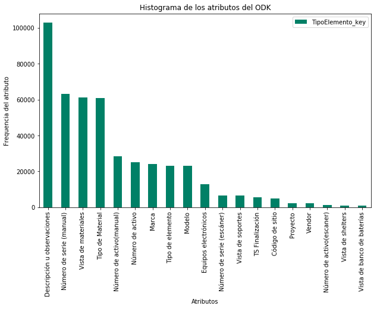

# Exploratory Data Analysis

## ODK 38 (ATT Decommissioning Report)

## Descripción

Analizaremos los datos de la fuente **ODK 38** que corresponde a los datos de salida de almacén, proveedor y códigos de sitio destino de los elementos de red gestionados en inventario, con un tratamiento estadístico descriptivo para la exploración, explotación y descubrimiento de los datos para un correcto tracking del ciclo de vida de los elementos de red. 

Primero cargamos las librerías necesarias.

#### Conectando al Datalake


```python
import os
os.environ['JAVA_HOME'] = '/usr/java/jdk1.8.0_162'
os.environ['SPARK_HOME'] = '/opt/cloudera/parcels/CDH-6.2.0-1.cdh6.2.0.p0.967373/lib/spark'
import findspark
findspark.init()
from pyspark import SparkContext, SparkConf
from pyspark.sql import SparkSession
from pyspark.sql.types import *
from pyspark.sql import HiveContext
```


```python
conf = SparkConf().setAppName('ODK_38')  \
    .setMaster('yarn').set("spark.yarn.queue","root.eda")  \
    .set("spark.kryoserializer.buffer.mb","128").set("spark.yarn.executor.memoryOverhead","409")

spark = SparkSession.builder.config(conf=conf).getOrCreate()
sc = spark.sparkContext
sqlContext = HiveContext(sc)
```


```python
import pandas as pd
import numpy as np
import matplotlib.pyplot as plt
from PIL import Image
import re


import nltk
from nltk.probability import FreqDist
from fuzzywuzzy import fuzz
from fuzzywuzzy import process

from pyspark.sql.functions import udf ,col
from pyspark.sql.types import IntegerType,StringType

%matplotlib inline

from bokeh.io import show, output_notebook, output_file 
from bokeh.plotting import figure
from bokeh.models import ColumnDataSource
from bokeh.palettes import Category20_11, Category20c_20, Category10_5,Category10_6, Category20_20, Plasma256
output_notebook()
```


## ODK 38
### 1. Recolección de los datos: 

Se crea el dataframe de spark con el universo de datos crudos.


```python
df_load103775 = spark.sql("SELECT * FROM default.tx_stg_06_tabular_odk_38 WHERE id_form=='103775'").cache()
```


```python
df_load=df_load103775.toPandas()
```


```python
df_load91523 = spark.sql("SELECT * FROM default.tx_stg_06_tabular_odk_38 WHERE id_form=='91523'").cache()
```


```python
df_load=df_load91523.toPandas()
```


```python
df_load114548 = spark.sql("SELECT * FROM default.tx_stg_06_tabular_odk_38 WHERE id_form=='114548'").cache()
```


```python
df_load=df_load114548.toPandas() 
```


```python
df_load104872 = spark.sql("SELECT * FROM default.tx_stg_06_tabular_odk_38 WHERE id_form=='104872'").cache()
```


```python
df_load=df_load104872.toPandas()
```


```python
df_load_all = spark.sql("SELECT * FROM default.tx_stg_06_tabular_odk_38").cache()
```


```python
df_load=df_load_all.toPandas()
```

Para las fuentes de los ODK's nos interesa conocer todos los elementos en sitio, por lo que haremos una limpieza en los campos que contengan características de los mismos.
Creamos una funcion para el tratamiento del campo de sitio en spark el cual contiene ciertas reglas definidas para su limpieza.

Hemos recolectado los campos a analizar de la fuente **odk 38**.

### Una muestra del ODK 38:


```python
df=df_load.copy()
#df=df.loc[df.exist==True] #Sólamente se usa en caso de querer filtrar el universo limpio en el campo TipoElemento_key
df.head(10)
```


<div>
<table border="1" class="dataframe">
  <thead>
    <tr style="text-align: right;">
      <th></th>
      <th>id_form</th>
      <th>clave_form</th>
      <th>element_group</th>
      <th>element</th>
      <th>exist</th>
      <th>TipoElemento_key</th>
      <th>TipoElemento_value</th>
    </tr>
  </thead>
  <tbody>
    <tr>
      <th>0</th>
      <td>100034</td>
      <td>DECOR</td>
      <td>groupMtlVwGrp-2</td>
      <td>groupMtlVwGrp-2</td>
      <td>True</td>
      <td>Vista de materiales</td>
      <td>1516807258622.jpg (image/jpeg)</td>
    </tr>
    <tr>
      <th>1</th>
      <td>100834</td>
      <td>DECOR</td>
      <td>groupMtlVwGrp-19</td>
      <td>groupMtlVwGrp-19</td>
      <td>True</td>
      <td>Vista de materiales</td>
      <td>1517463521051.jpg (image/jpeg)</td>
    </tr>
    <tr>
      <th>2</th>
      <td>100841</td>
      <td>DECOR</td>
      <td>groupMtlVwGrp-4</td>
      <td>groupMtlVwGrp-4</td>
      <td>True</td>
      <td>Vista de materiales</td>
      <td>1517499517764.jpg (image/jpeg)</td>
    </tr>
    <tr>
      <th>3</th>
      <td>100884</td>
      <td>DECOR</td>
      <td>groupMtlVwGrp-20</td>
      <td>groupMtlVwGrp-20</td>
      <td>True</td>
      <td>Vista de materiales</td>
      <td>1517600581923.jpg (image/jpeg)</td>
    </tr>
    <tr>
      <th>4</th>
      <td>100884</td>
      <td>DECOR</td>
      <td>groupMtlVwGrp-5</td>
      <td>groupMtlVwGrp-5</td>
      <td>True</td>
      <td>Vista de materiales</td>
      <td>1517599751080.jpg (image/jpeg)</td>
    </tr>
    <tr>
      <th>5</th>
      <td>100925</td>
      <td>DECOR</td>
      <td>groupMtlVwGrp-7</td>
      <td>groupMtlVwGrp-7</td>
      <td>True</td>
      <td>Vista de materiales</td>
      <td>1517496281723.jpg (image/jpeg)</td>
    </tr>
    <tr>
      <th>6</th>
      <td>101306</td>
      <td>DECOR</td>
      <td>groupMtlVwGrp-3</td>
      <td>groupMtlVwGrp-3</td>
      <td>True</td>
      <td>Vista de materiales</td>
      <td>1518235394537.jpg (image/jpeg)</td>
    </tr>
    <tr>
      <th>7</th>
      <td>101568</td>
      <td>DECOR</td>
      <td>groupMtlVwGrp-14</td>
      <td>groupMtlVwGrp-14</td>
      <td>True</td>
      <td>Vista de materiales</td>
      <td>1518746589523.jpg (image/jpeg)</td>
    </tr>
    <tr>
      <th>8</th>
      <td>101574</td>
      <td>DECOR</td>
      <td>groupMtlVwGrp-1</td>
      <td>groupMtlVwGrp-1</td>
      <td>True</td>
      <td>Vista de materiales</td>
      <td>1518747796845.jpg (image/jpeg)</td>
    </tr>
    <tr>
      <th>9</th>
      <td>101582</td>
      <td>DECOR</td>
      <td>groupMtlVwGrp-0</td>
      <td>groupMtlVwGrp-0</td>
      <td>True</td>
      <td>Vista de materiales</td>
      <td>1518756878961.jpg (image/jpeg)</td>
    </tr>
  </tbody>
</table>
</div>


### 2. Descripción de las fuentes.
En este apartado se hará una descripción a detalle de las fuentes para una mejor comprensión de los datos. Por cada fuente se mostrarán los tipos de datos, tamaño de la fuente, es decir, su dimensionalidad y una estadística descriptiva, en ese orden.


```python
print 'renglones = ',df.shape[0],' columnas = ',df.shape[1]
```

    renglones =  544634  columnas =  7


#### Una breve descripción de los campos:
* **id_form**: Número de formulario en *Panda*.
* **clave_form**: Clave de identificación del ODK.
* **element_group**: Element group.
* **element**: Hijo del element group.
* **exist**: Campo diseñado durante la extracción de los datos para identificar que el campo buscado se encuentra existente.
* **TipoElemento_key**: Nombre del campo.
* **TipoElemento_value**: Atributo del campo.

Con la transformación que se llevo a cabo previamente, los campos id_form, clave_form, element_group, element, exist sirven para tener un control y mejor manejo del odk. Los campos TipoElemento_key y TipoElemento_value son los que se utilizarán para sacar indicadores.

### 3. Exploración de los datos.
De acuerdo al análisis anterior, procederemos a observar algunos detalles de la fuente:


```python
print 'Los atributos priority que encontramos en este ODK en los distintos element groups son:'
Freq_Atributos=pd.DataFrame(df.TipoElemento_key.value_counts())
Freq_Atributos
```

    Los atributos priority que encontramos en este ODK en los distintos element groups son:


<div>
<table border="1" class="dataframe">
  <thead>
    <tr style="text-align: right;">
      <th></th>
      <th>TipoElemento_key</th>
    </tr>
  </thead>
  <tbody>
    <tr>
      <th>Descripción u observaciones</th>
      <td>102875</td>
    </tr>
    <tr>
      <th>Número de serie (manual)</th>
      <td>63293</td>
    </tr>
    <tr>
      <th>Vista de materiales</th>
      <td>61190</td>
    </tr>
    <tr>
      <th>Tipo de Material</th>
      <td>60967</td>
    </tr>
    <tr>
      <th>Número de activo(manual)</th>
      <td>28317</td>
    </tr>
    <tr>
      <th>Número de activo</th>
      <td>25205</td>
    </tr>
    <tr>
      <th>Marca</th>
      <td>24141</td>
    </tr>
    <tr>
      <th>Tipo de elemento</th>
      <td>23117</td>
    </tr>
    <tr>
      <th>Modelo</th>
      <td>23073</td>
    </tr>
    <tr>
      <th>Equipos electrónicos</th>
      <td>12925</td>
    </tr>
    <tr>
      <th>Número de serie (escáner)</th>
      <td>6673</td>
    </tr>
    <tr>
      <th>Vista de soportes</th>
      <td>6411</td>
    </tr>
    <tr>
      <th>TS Finalización</th>
      <td>5644</td>
    </tr>
    <tr>
      <th>Código de sitio</th>
      <td>4952</td>
    </tr>
    <tr>
      <th>Proyecto</th>
      <td>2211</td>
    </tr>
    <tr>
      <th>Vendor</th>
      <td>2211</td>
    </tr>
    <tr>
      <th>Número de activo(escaner)</th>
      <td>1155</td>
    </tr>
    <tr>
      <th>Vista de shelters</th>
      <td>901</td>
    </tr>
    <tr>
      <th>Vista de banco de baterías</th>
      <td>870</td>
    </tr>
  </tbody>
</table>
</div>


```python
Freq_Atributos.plot(kind='bar',figsize=(10,6),rot=90,colormap='summer')

plt.title('Histograma de los atributos del ODK')
plt.ylabel('Frequencia del atributo')
plt.xlabel('Atributos')
```


    Text(0.5,0,'Atributos')





#### Se hará una limpieza para homologar los campos de serie y activo:


```python
stoppers=[u'numero de',u'escaner',u'manual']
df['TipoElemento_Key_Clean']=df.TipoElemento_key

df.TipoElemento_Key_Clean=df.TipoElemento_Key_Clean.str.lower()
df.TipoElemento_Key_Clean=df.TipoElemento_Key_Clean.str.replace("\)",'')
df.TipoElemento_Key_Clean=df.TipoElemento_Key_Clean.str.replace("\(",'')
df.TipoElemento_Key_Clean.replace(u'á',u'a',regex=True,inplace=True)
df.TipoElemento_Key_Clean.replace(u'é',u'e',regex=True,inplace=True)
df.TipoElemento_Key_Clean.replace(u'í',u'i',regex=True,inplace=True)
df.TipoElemento_Key_Clean.replace(u'ó',u'o',regex=True,inplace=True)
df.TipoElemento_Key_Clean.replace(u'ú',u'u',regex=True,inplace=True)
df.TipoElemento_Key_Clean.replace(u'ú',u'u',regex=True,inplace=True)
df.TipoElemento_Key_Clean.replace(stoppers,u'',regex=True,inplace=True)
df.TipoElemento_Key_Clean=df.TipoElemento_Key_Clean.str.strip()
```

#### Después de haber pasado una limpieza, podemos tener homologados los campos:


```python
pd.DataFrame(df.TipoElemento_Key_Clean.value_counts())
```


<div>
<table border="1" class="dataframe">
  <thead>
    <tr style="text-align: right;">
      <th></th>
      <th>TipoElemento_Key_Clean</th>
    </tr>
  </thead>
  <tbody>
    <tr>
      <th>descripcion u observaciones</th>
      <td>102875</td>
    </tr>
    <tr>
      <th>serie</th>
      <td>69966</td>
    </tr>
    <tr>
      <th>vista de materiales</th>
      <td>61190</td>
    </tr>
    <tr>
      <th>tipo de material</th>
      <td>60967</td>
    </tr>
    <tr>
      <th>activo</th>
      <td>54677</td>
    </tr>
    <tr>
      <th>marca</th>
      <td>24141</td>
    </tr>
    <tr>
      <th>tipo de elemento</th>
      <td>23117</td>
    </tr>
    <tr>
      <th>modelo</th>
      <td>23073</td>
    </tr>
    <tr>
      <th>equipos electronicos</th>
      <td>12925</td>
    </tr>
    <tr>
      <th>vista de soportes</th>
      <td>6411</td>
    </tr>
    <tr>
      <th>ts finalizacion</th>
      <td>5644</td>
    </tr>
    <tr>
      <th>codigo de sitio</th>
      <td>4952</td>
    </tr>
    <tr>
      <th>proyecto</th>
      <td>2211</td>
    </tr>
    <tr>
      <th>vendor</th>
      <td>2211</td>
    </tr>
    <tr>
      <th>vista de shelters</th>
      <td>901</td>
    </tr>
    <tr>
      <th>vista de banco de baterias</th>
      <td>870</td>
    </tr>
  </tbody>
</table>
</div>


```python
pd.DataFrame(df.TipoElemento_value.loc[df.TipoElemento_Key_Clean=='serie'].describe())
```


<div>
<table border="1" class="dataframe">
  <thead>
    <tr style="text-align: right;">
      <th></th>
      <th>TipoElemento_value</th>
    </tr>
  </thead>
  <tbody>
    <tr>
      <th>count</th>
      <td>69966</td>
    </tr>
    <tr>
      <th>unique</th>
      <td>28042</td>
    </tr>
    <tr>
      <th>top</th>
      <td>No visible</td>
    </tr>
    <tr>
      <th>freq</th>
      <td>18048</td>
    </tr>
  </tbody>
</table>
</div>


```python
pd.DataFrame(df.TipoElemento_value.loc[df.TipoElemento_Key_Clean=='activo'].describe())
```


<div>
<table border="1" class="dataframe">
  <thead>
    <tr style="text-align: right;">
      <th></th>
      <th>TipoElemento_value</th>
    </tr>
  </thead>
  <tbody>
    <tr>
      <th>count</th>
      <td>52231</td>
    </tr>
    <tr>
      <th>unique</th>
      <td>11125</td>
    </tr>
    <tr>
      <th>top</th>
      <td>No visible</td>
    </tr>
    <tr>
      <th>freq</th>
      <td>16034</td>
    </tr>
  </tbody>
</table>
</div>


#### Campo *marca*


```python
Cat_marca=pd.DataFrame(df.TipoElemento_value.loc[df.TipoElemento_Key_Clean=='marca']).drop_duplicates().reset_index(drop=True)
Cat_marca.head(10)
```


<div>
<table border="1" class="dataframe">
  <thead>
    <tr style="text-align: right;">
      <th></th>
      <th>TipoElemento_value</th>
    </tr>
  </thead>
  <tbody>
    <tr>
      <th>0</th>
      <td>OTH</td>
    </tr>
    <tr>
      <th>1</th>
      <td>ADW</td>
    </tr>
    <tr>
      <th>2</th>
      <td>HWI</td>
    </tr>
    <tr>
      <th>3</th>
      <td>ECS</td>
    </tr>
    <tr>
      <th>4</th>
      <td>MOTO</td>
    </tr>
    <tr>
      <th>5</th>
      <td>Huawei</td>
    </tr>
    <tr>
      <th>6</th>
      <td>Motorola</td>
    </tr>
    <tr>
      <th>7</th>
      <td>ADC</td>
    </tr>
    <tr>
      <th>8</th>
      <td>No visible</td>
    </tr>
    <tr>
      <th>9</th>
      <td>Harris</td>
    </tr>
  </tbody>
</table>
</div>


Podemos encontrar un campo no homologado. Se hará un esfuerzo para limpiar el campo y crear un catálogo.


```python
dirt=['no visible','n/v','nv','ilegible','n/a','na','no legible',
      'n/v deteriorado','sin activo fijo','no vicible','no hay','no tiene','No visble','no visble',
      'No viaible','noisible','no aplica','n /v','finizar','no bisible','finisar','finsar','ftlfpbnl']
nums=['1','2','3','4','5','6','7','8','9','0']

Cat_marca.TipoElemento_value=Cat_marca.TipoElemento_value.str.lower()
Cat_marca.TipoElemento_value=Cat_marca.TipoElemento_value.str.replace('.','')
Cat_marca.TipoElemento_value=Cat_marca.TipoElemento_value.str.strip()
Cat_marca.replace(r'^\s*$', np.NaN, regex=True,inplace=True)
Cat_marca.replace(u'inc','',regex=True,inplace=True)
Cat_marca.replace(dirt,'',regex=True,inplace=True)
Cat_marca.replace(nums,'',regex=True,inplace=True)
Cat_marca.dropna(inplace=True)
Cat_marca.TipoElemento_value.drop_duplicates(inplace=True)
Cat_marca.reset_index(drop=True,inplace=True)
Cat_marca=Cat_marca.loc[(Cat_marca.TipoElemento_value.str.len()>2)]
Cat_marca.reset_index(drop=True,inplace=True)
Cat_marca.head(10)
```


<div>
<table border="1" class="dataframe">
  <thead>
    <tr style="text-align: right;">
      <th></th>
      <th>TipoElemento_value</th>
    </tr>
  </thead>
  <tbody>
    <tr>
      <th>0</th>
      <td>oth</td>
    </tr>
    <tr>
      <th>1</th>
      <td>adw</td>
    </tr>
    <tr>
      <th>2</th>
      <td>hwi</td>
    </tr>
    <tr>
      <th>3</th>
      <td>ecs</td>
    </tr>
    <tr>
      <th>4</th>
      <td>moto</td>
    </tr>
    <tr>
      <th>5</th>
      <td>huawei</td>
    </tr>
    <tr>
      <th>6</th>
      <td>motorola</td>
    </tr>
    <tr>
      <th>7</th>
      <td>adc</td>
    </tr>
    <tr>
      <th>8</th>
      <td>harris</td>
    </tr>
    <tr>
      <th>9</th>
      <td>huawei</td>
    </tr>
  </tbody>
</table>
</div>


```python
fdist=FreqDist(Cat_marca.TipoElemento_value)
fdist.most_common(100)
```


    [(u'huawei', 5),
     (u'alcatel', 5),
     (u'adc', 4),
     (u'motorola', 4),
     (u'cisco', 4),
     (u'nec', 4),
     (u'dekolink', 4),
     (u'harris', 4),
     (u'trimm', 4),
     (u'power worx', 3),
     (u'nec pasolink', 3),
     (u'huawey', 3),
     (u'tellabs', 3),
     (u'hubbell', 3),
     (u'telect', 3),
     (u'powerworx', 3),
     (u'ericsson', 3),
     (u'avago', 3),
     (u'trimm ', 3),
     (u'ceragon', 3),
     (u'elisra', 2),
     (u'mini-link', 2),
     (u'apex', 2),
     (u'fnisar', 2),
     (u'vapel', 2),
     (u'dsx', 2),
     (u'alcatel lucent', 2),
     (u'square', 2),
     (u'apex series', 2),
     (u'bard', 2),
     (u'esquardi', 2),
     (u'teltec', 2),
     (u'fiber', 2),
     (u'atel', 2),
     (u'square d', 2),
     (u'lorain', 2),
     (u'bticino', 2),
     (u'cti', 2),
     (u'ftlfpbnl-hw', 2),
     (u'ericksson', 2),
     (u'bbu', 2),
     (u'stahlin', 2),
     (u'allied telesyn', 2),
     (u'andrew', 2),
     (u'alcatel-lucent', 2),
     (u'jdsu g', 2),
     (u'emerson', 2),
     (u'dxr', 2),
     (u'huwei', 2),
     (u'nera', 2),
     (u'harrys', 2),
     (u'bdcom', 2),
     (u'ericson', 2),
     (u'jdsu', 2),
     (u'telcet', 2),
     (u'telet', 2),
     (u'telec', 2),
     (u'radwin', 2),
     (u'celwave', 2),
     (u'tecno strobe', 1),
     (u'ce ', 1),
     (u'wmpt', 1),
     (u'star microwave', 1),
     (u'huawei bbu', 1),
     (u'wuawei', 1),
     (u'dekokink', 1),
     (u'vectronic', 1),
     (u'harris stratex', 1),
     (u'telect ', 1),
     (u'adw', 1),
     (u'fiberair ip-', 1),
     (u'dsx adc', 1),
     (u'ads', 1),
     (u'big-ip', 1),
     (u'motorol', 1),
     (u'ajdsu g', 1),
     (u'proxim', 1),
     (u'capauxn', 1),
     (u'tejas networks', 1),
     (u'exalt', 1),
     (u'hpmi', 1),
     (u'comba', 1),
     (u'alcatel -lucent', 1),
     (u'trinm', 1),
     (u'one power', 1),
     (u'nom', 1),
     (u'p/z', 1),
     (u'dac', 1),
     (u'nokia', 1),
     (u'no visivle', 1),
     (u'idu', 1),
     (u'stratex', 1),
     (u'fuch panel negro', 1),
     (u'fan', 1),
     (u'delta electr\xf3nics ', 1),
     (u'ads powermax', 1),
     (u'ibm', 1),
     (u'rfs', 1),
     (u'uflp', 1),
     (u'smart ax', 1)]


```python
len(fdist)
```


    291


```python
Clean_marca=[v for v,k in fdist.items() if k>2]
Clean_marca.append('ibm')
Clean_marca.append('vectronic')
Clean_marca.append('tecno strobe')
Clean_marca.remove(u'huawey')
Clean_marca
```


    [u'power worx',
     u'adc',
     u'nec pasolink',
     u'motorola',
     u'cisco',
     u'nec',
     u'huawei',
     u'tellabs',
     u'dekolink',
     u'hubbell',
     u'telect',
     u'powerworx',
     u'ericsson',
     u'avago',
     u'trimm ',
     u'harris',
     u'trimm',
     u'alcatel',
     u'ceragon',
     'ibm',
     'vectronic',
     'tecno strobe']


```python
Cat_marca['Clean']=1
for v in range(0,Cat_marca.shape[0]):
    Cat_marca.Clean[v]=process.extractOne(Cat_marca.TipoElemento_value[v],
                                            Clean_marca,
                                            scorer=fuzz.partial_ratio,
                                            score_cutoff=67)
    if Cat_marca.Clean[v] is None:
        Cat_marca.Clean[v]=Cat_marca.TipoElemento_value[v]
    else:
        Cat_marca.Clean[v]=Cat_marca.Clean[v][0]

Cat_marca.head(15)
```

    /opt/cloudera/parcels/Anaconda-5.3.1/lib/python2.7/site-packages/ipykernel_launcher.py:6: SettingWithCopyWarning: 
    A value is trying to be set on a copy of a slice from a DataFrame
    
    See the caveats in the documentation: http://pandas.pydata.org/pandas-docs/stable/indexing.html#indexing-view-versus-copy
      
    /opt/cloudera/parcels/Anaconda-5.3.1/lib/python2.7/site-packages/pandas/core/indexing.py:189: SettingWithCopyWarning: 
    A value is trying to be set on a copy of a slice from a DataFrame
    
    See the caveats in the documentation: http://pandas.pydata.org/pandas-docs/stable/indexing.html#indexing-view-versus-copy
      self._setitem_with_indexer(indexer, value)


<div>
<table border="1" class="dataframe">
  <thead>
    <tr style="text-align: right;">
      <th></th>
      <th>TipoElemento_value</th>
      <th>Clean</th>
    </tr>
  </thead>
  <tbody>
    <tr>
      <th>0</th>
      <td>oth</td>
      <td>motorola</td>
    </tr>
    <tr>
      <th>1</th>
      <td>adw</td>
      <td>adc</td>
    </tr>
    <tr>
      <th>2</th>
      <td>hwi</td>
      <td>huawei</td>
    </tr>
    <tr>
      <th>3</th>
      <td>ecs</td>
      <td>nec</td>
    </tr>
    <tr>
      <th>4</th>
      <td>moto</td>
      <td>motorola</td>
    </tr>
    <tr>
      <th>5</th>
      <td>huawei</td>
      <td>huawei</td>
    </tr>
    <tr>
      <th>6</th>
      <td>motorola</td>
      <td>motorola</td>
    </tr>
    <tr>
      <th>7</th>
      <td>adc</td>
      <td>adc</td>
    </tr>
    <tr>
      <th>8</th>
      <td>harris</td>
      <td>harris</td>
    </tr>
    <tr>
      <th>9</th>
      <td>huawei</td>
      <td>huawei</td>
    </tr>
    <tr>
      <th>10</th>
      <td>motorola</td>
      <td>motorola</td>
    </tr>
    <tr>
      <th>11</th>
      <td>alcatel</td>
      <td>alcatel</td>
    </tr>
    <tr>
      <th>12</th>
      <td>harris</td>
      <td>harris</td>
    </tr>
    <tr>
      <th>13</th>
      <td>nec</td>
      <td>nec pasolink</td>
    </tr>
    <tr>
      <th>14</th>
      <td>alcatel</td>
      <td>alcatel</td>
    </tr>
  </tbody>
</table>
</div>


Mostramos los primeros registros del catálogo terminado:


```python
Cat_marca.drop(columns=['TipoElemento_value'],inplace=True)
Cat_marca.columns=['Atributos']
Cat_marca.drop_duplicates(inplace=True)
Cat_marca.head(10)
```


<div>
<style scoped>
    .dataframe tbody tr th:only-of-type {
        vertical-align: middle;
    }

    .dataframe tbody tr th {
        vertical-align: top;
    }

    .dataframe thead th {
        text-align: right;
    }
</style>
<table border="1" class="dataframe">
  <thead>
    <tr style="text-align: right;">
      <th></th>
      <th>Atributos</th>
    </tr>
  </thead>
  <tbody>
    <tr>
      <th>0</th>
      <td>motorola</td>
    </tr>
    <tr>
      <th>1</th>
      <td>adc</td>
    </tr>
    <tr>
      <th>2</th>
      <td>huawei</td>
    </tr>
    <tr>
      <th>3</th>
      <td>nec</td>
    </tr>
    <tr>
      <th>8</th>
      <td>harris</td>
    </tr>
    <tr>
      <th>11</th>
      <td>alcatel</td>
    </tr>
    <tr>
      <th>13</th>
      <td>nec pasolink</td>
    </tr>
    <tr>
      <th>16</th>
      <td>telect</td>
    </tr>
    <tr>
      <th>19</th>
      <td>ericsson</td>
    </tr>
    <tr>
      <th>20</th>
      <td>lorain</td>
    </tr>
  </tbody>
</table>
</div>


#### Campo *modelo*


```python
Cat_modelo=pd.DataFrame(df.TipoElemento_value.loc[df.TipoElemento_Key_Clean=='modelo']).drop_duplicates().reset_index(drop=True)
Cat_modelo.head(10)
```


<div>
<table border="1" class="dataframe">
  <thead>
    <tr style="text-align: right;">
      <th></th>
      <th>TipoElemento_value</th>
    </tr>
  </thead>
  <tbody>
    <tr>
      <th>0</th>
      <td>Andrew</td>
    </tr>
    <tr>
      <th>1</th>
      <td>No visible</td>
    </tr>
    <tr>
      <th>2</th>
      <td>N/V</td>
    </tr>
    <tr>
      <th>3</th>
      <td>Nv</td>
    </tr>
    <tr>
      <th>4</th>
      <td>DB844H65-XY</td>
    </tr>
    <tr>
      <th>5</th>
      <td>Na</td>
    </tr>
    <tr>
      <th>6</th>
      <td>1200</td>
    </tr>
    <tr>
      <th>7</th>
      <td>HBX-6516DS-VTM</td>
    </tr>
    <tr>
      <th>8</th>
      <td>NV</td>
    </tr>
    <tr>
      <th>9</th>
      <td>no visible</td>
    </tr>
  </tbody>
</table>
</div>


Se hará limpieza sobre el campo.
Podrá encontrarse el catálogo en el apartado **Catálogos**.

#### Campo *tipo de elemento*


```python
Cat_tipo_elem=pd.DataFrame(df.TipoElemento_value.loc[df.TipoElemento_Key_Clean=='tipo de elemento']).drop_duplicates().reset_index(drop=True)
Cat_tipo_elem
```


<div>
<table border="1" class="dataframe">
  <thead>
    <tr style="text-align: right;">
      <th></th>
      <th>TipoElemento_value</th>
    </tr>
  </thead>
  <tbody>
    <tr>
      <th>0</th>
      <td>AMW</td>
    </tr>
    <tr>
      <th>1</th>
      <td>ARF</td>
    </tr>
    <tr>
      <th>2</th>
      <td>RRU</td>
    </tr>
    <tr>
      <th>3</th>
      <td>ODU</td>
    </tr>
    <tr>
      <th>4</th>
      <td>SCLL</td>
    </tr>
    <tr>
      <th>5</th>
      <td>IDU</td>
    </tr>
    <tr>
      <th>6</th>
      <td>ACOP</td>
    </tr>
    <tr>
      <th>7</th>
      <td>BR</td>
    </tr>
    <tr>
      <th>8</th>
      <td>DSX</td>
    </tr>
    <tr>
      <th>9</th>
      <td>OTH</td>
    </tr>
    <tr>
      <th>10</th>
      <td>FP</td>
    </tr>
    <tr>
      <th>11</th>
      <td>BBU</td>
    </tr>
    <tr>
      <th>12</th>
      <td>FAN</td>
    </tr>
  </tbody>
</table>
</div>


No se hará limpieza sobre el campo, se encuentra en buen estado.  
Podrá encontrarse el catálogo en el apartado **Catálogos**.

#### Hacemos más limpieza para poder eliminar basura.
Esta limpieza se sigue tomando del catálogo que se encuentra en Hive *regex_cat_cleanup*.


```python
dirt=['no visible','n/v','nv','ilegible','n/a','na','no legible',
      'n/v deteriorado','sin activo fijo','no vicible','no hay','no tiene','No visble','no visble',
      'No viaible','noisible','no aplica','n /v','finizar','no bisible','finisar','finsar','ftlfpbnl']

df.TipoElemento_value=df.TipoElemento_value.str.lower()
df.TipoElemento_value.replace(dirt,np.NaN,regex=True,inplace=True)
df.TipoElemento_value=df.TipoElemento_value.str.strip()
```

#### Se ha podido notar que el campo **marca** contiene registros sucios que pertenecen al catálogo de *Tipos de elementos*.
Haremos un proceso de limpieza para poder eliminar estos registros.


```python
elementos=list(Cat_tipo_elem.TipoElemento_value.str.lower())
Cat_marca.replace(elementos,np.NaN,regex=True,inplace=True)
Cat_marca.head(10)
```


<div>
<table border="1" class="dataframe">
  <thead>
    <tr style="text-align: right;">
      <th></th>
      <th>Atributos</th>
    </tr>
  </thead>
  <tbody>
    <tr>
      <th>0</th>
      <td>motorola</td>
    </tr>
    <tr>
      <th>1</th>
      <td>adc</td>
    </tr>
    <tr>
      <th>2</th>
      <td>huawei</td>
    </tr>
    <tr>
      <th>3</th>
      <td>nec</td>
    </tr>
    <tr>
      <th>8</th>
      <td>harris</td>
    </tr>
    <tr>
      <th>11</th>
      <td>alcatel</td>
    </tr>
    <tr>
      <th>13</th>
      <td>nec pasolink</td>
    </tr>
    <tr>
      <th>16</th>
      <td>telect</td>
    </tr>
    <tr>
      <th>19</th>
      <td>ericsson</td>
    </tr>
    <tr>
      <th>20</th>
      <td>lorain</td>
    </tr>
  </tbody>
</table>
</div>


Crearemos una bandera para los atributos de trazabilidad.


```python
df['Trazabilidad']='No Trazable'

df['Trazabilidad'].loc[((df.TipoElemento_Key_Clean=='serie') | 
                        (df.TipoElemento_Key_Clean=='activo')) & 
                       (df.TipoElemento_value is not np.NaN)
                      ]='Trazable'
```


```python
df.head(20)
```


<div>
<table border="1" class="dataframe">
  <thead>
    <tr style="text-align: right;">
      <th></th>
      <th>id_form</th>
      <th>clave_form</th>
      <th>element_group</th>
      <th>element</th>
      <th>exist</th>
      <th>TipoElemento_key</th>
      <th>TipoElemento_value</th>
      <th>TipoElemento_Key_Clean</th>
      <th>Trazabilidad</th>
    </tr>
  </thead>
  <tbody>
    <tr>
      <th>0</th>
      <td>100034</td>
      <td>DECOR</td>
      <td>groupMtlVwGrp-2</td>
      <td>groupMtlVwGrp-2</td>
      <td>True</td>
      <td>Vista de materiales</td>
      <td>1516807258622.jpg (image/jpeg)</td>
      <td>vista de materiales</td>
      <td>No Trazable</td>
    </tr>
    <tr>
      <th>1</th>
      <td>100834</td>
      <td>DECOR</td>
      <td>groupMtlVwGrp-19</td>
      <td>groupMtlVwGrp-19</td>
      <td>True</td>
      <td>Vista de materiales</td>
      <td>1517463521051.jpg (image/jpeg)</td>
      <td>vista de materiales</td>
      <td>No Trazable</td>
    </tr>
    <tr>
      <th>2</th>
      <td>100841</td>
      <td>DECOR</td>
      <td>groupMtlVwGrp-4</td>
      <td>groupMtlVwGrp-4</td>
      <td>True</td>
      <td>Vista de materiales</td>
      <td>1517499517764.jpg (image/jpeg)</td>
      <td>vista de materiales</td>
      <td>No Trazable</td>
    </tr>
    <tr>
      <th>3</th>
      <td>100884</td>
      <td>DECOR</td>
      <td>groupMtlVwGrp-20</td>
      <td>groupMtlVwGrp-20</td>
      <td>True</td>
      <td>Vista de materiales</td>
      <td>1517600581923.jpg (image/jpeg)</td>
      <td>vista de materiales</td>
      <td>No Trazable</td>
    </tr>
    <tr>
      <th>4</th>
      <td>100884</td>
      <td>DECOR</td>
      <td>groupMtlVwGrp-5</td>
      <td>groupMtlVwGrp-5</td>
      <td>True</td>
      <td>Vista de materiales</td>
      <td>1517599751080.jpg (image/jpeg)</td>
      <td>vista de materiales</td>
      <td>No Trazable</td>
    </tr>
    <tr>
      <th>5</th>
      <td>100925</td>
      <td>DECOR</td>
      <td>groupMtlVwGrp-7</td>
      <td>groupMtlVwGrp-7</td>
      <td>True</td>
      <td>Vista de materiales</td>
      <td>1517496281723.jpg (image/jpeg)</td>
      <td>vista de materiales</td>
      <td>No Trazable</td>
    </tr>
    <tr>
      <th>6</th>
      <td>101306</td>
      <td>DECOR</td>
      <td>groupMtlVwGrp-3</td>
      <td>groupMtlVwGrp-3</td>
      <td>True</td>
      <td>Vista de materiales</td>
      <td>1518235394537.jpg (image/jpeg)</td>
      <td>vista de materiales</td>
      <td>No Trazable</td>
    </tr>
    <tr>
      <th>7</th>
      <td>101568</td>
      <td>DECOR</td>
      <td>groupMtlVwGrp-14</td>
      <td>groupMtlVwGrp-14</td>
      <td>True</td>
      <td>Vista de materiales</td>
      <td>1518746589523.jpg (image/jpeg)</td>
      <td>vista de materiales</td>
      <td>No Trazable</td>
    </tr>
    <tr>
      <th>8</th>
      <td>101574</td>
      <td>DECOR</td>
      <td>groupMtlVwGrp-1</td>
      <td>groupMtlVwGrp-1</td>
      <td>True</td>
      <td>Vista de materiales</td>
      <td>1518747796845.jpg (image/jpeg)</td>
      <td>vista de materiales</td>
      <td>No Trazable</td>
    </tr>
    <tr>
      <th>9</th>
      <td>101582</td>
      <td>DECOR</td>
      <td>groupMtlVwGrp-0</td>
      <td>groupMtlVwGrp-0</td>
      <td>True</td>
      <td>Vista de materiales</td>
      <td>1518756878961.jpg (image/jpeg)</td>
      <td>vista de materiales</td>
      <td>No Trazable</td>
    </tr>
    <tr>
      <th>10</th>
      <td>101647</td>
      <td>DECOR</td>
      <td>groupMtlVwGrp-4</td>
      <td>groupMtlVwGrp-4</td>
      <td>True</td>
      <td>Vista de materiales</td>
      <td>1518883858644.jpg (image/jpeg)</td>
      <td>vista de materiales</td>
      <td>No Trazable</td>
    </tr>
    <tr>
      <th>11</th>
      <td>101713</td>
      <td>DECOR</td>
      <td>groupMtlVwGrp-6</td>
      <td>groupMtlVwGrp-6</td>
      <td>True</td>
      <td>Vista de materiales</td>
      <td>1519150201550.jpg (image/jpeg)</td>
      <td>vista de materiales</td>
      <td>No Trazable</td>
    </tr>
    <tr>
      <th>12</th>
      <td>101736</td>
      <td>DECOR</td>
      <td>groupMtlVwGrp-19</td>
      <td>groupMtlVwGrp-19</td>
      <td>True</td>
      <td>Vista de materiales</td>
      <td>1519171748007.jpg (image/jpeg)</td>
      <td>vista de materiales</td>
      <td>No Trazable</td>
    </tr>
    <tr>
      <th>13</th>
      <td>101827</td>
      <td>DECOR</td>
      <td>groupMtlVwGrp-4</td>
      <td>groupMtlVwGrp-4</td>
      <td>True</td>
      <td>Vista de materiales</td>
      <td>1519255502340.jpg (image/jpeg)</td>
      <td>vista de materiales</td>
      <td>No Trazable</td>
    </tr>
    <tr>
      <th>14</th>
      <td>101887</td>
      <td>DECOR</td>
      <td>groupMtlVwGrp-0</td>
      <td>groupMtlVwGrp-0</td>
      <td>True</td>
      <td>Vista de materiales</td>
      <td>1519329636548.jpg (image/jpeg)</td>
      <td>vista de materiales</td>
      <td>No Trazable</td>
    </tr>
    <tr>
      <th>15</th>
      <td>101887</td>
      <td>DECOR</td>
      <td>groupMtlVwGrp-14</td>
      <td>groupMtlVwGrp-14</td>
      <td>True</td>
      <td>Vista de materiales</td>
      <td>1519329853686.jpg (image/jpeg)</td>
      <td>vista de materiales</td>
      <td>No Trazable</td>
    </tr>
    <tr>
      <th>16</th>
      <td>102122</td>
      <td>DECOR</td>
      <td>groupMtlVwGrp-24</td>
      <td>groupMtlVwGrp-24</td>
      <td>True</td>
      <td>Vista de materiales</td>
      <td>1519073688286.jpg (image/jpeg)</td>
      <td>vista de materiales</td>
      <td>No Trazable</td>
    </tr>
    <tr>
      <th>17</th>
      <td>102576</td>
      <td>DECOR</td>
      <td>groupMtlVwGrp-13</td>
      <td>groupMtlVwGrp-13</td>
      <td>True</td>
      <td>Vista de materiales</td>
      <td>1519924331614.jpg (image/jpeg)</td>
      <td>vista de materiales</td>
      <td>No Trazable</td>
    </tr>
    <tr>
      <th>18</th>
      <td>102675</td>
      <td>DECOR</td>
      <td>groupMtlVwGrp-22</td>
      <td>groupMtlVwGrp-22</td>
      <td>True</td>
      <td>Vista de materiales</td>
      <td>1520031562910.jpg (image/jpeg)</td>
      <td>vista de materiales</td>
      <td>No Trazable</td>
    </tr>
    <tr>
      <th>19</th>
      <td>102695</td>
      <td>DECOR</td>
      <td>groupMtlVwGrp-16</td>
      <td>groupMtlVwGrp-16</td>
      <td>True</td>
      <td>Vista de materiales</td>
      <td>1520046565694.jpg (image/jpeg)</td>
      <td>vista de materiales</td>
      <td>No Trazable</td>
    </tr>
  </tbody>
</table>
</div>


### 4. Calidad de los datos.
En el parseo de nuestra fuente de ODK se creo el campo de *exist* que corresponde a la limpieza de los atributos que se encuentran en el formulario, con esto eliminando missing values.

### 5. Catálogos.
Se enlistan los catálogos que surgieron de la exploración. 

#### Catálogo Marca

Se muestran los primeros 10 registros:


```python
Cat_marca.head(10)
```


<div>
<table border="1" class="dataframe">
  <thead>
    <tr style="text-align: right;">
      <th></th>
      <th>Atributos</th>
    </tr>
  </thead>
  <tbody>
    <tr>
      <th>0</th>
      <td>motorola</td>
    </tr>
    <tr>
      <th>1</th>
      <td>adc</td>
    </tr>
    <tr>
      <th>2</th>
      <td>huawei</td>
    </tr>
    <tr>
      <th>3</th>
      <td>nec</td>
    </tr>
    <tr>
      <th>8</th>
      <td>harris</td>
    </tr>
    <tr>
      <th>11</th>
      <td>alcatel</td>
    </tr>
    <tr>
      <th>13</th>
      <td>nec pasolink</td>
    </tr>
    <tr>
      <th>16</th>
      <td>telect</td>
    </tr>
    <tr>
      <th>19</th>
      <td>ericsson</td>
    </tr>
    <tr>
      <th>20</th>
      <td>lorain</td>
    </tr>
  </tbody>
</table>
</div>


#### Catálogo Modelo


```python
Cat_modelo=pd.DataFrame(df.TipoElemento_value.loc[df.TipoElemento_Key_Clean=='modelo']).drop_duplicates().reset_index(drop=True)
Cat_modelo.dropna(inplace=True)
Cat_modelo.reset_index(drop=True)
Cat_modelo.head(10)
```


<div>
<table border="1" class="dataframe">
  <thead>
    <tr style="text-align: right;">
      <th></th>
      <th>TipoElemento_value</th>
    </tr>
  </thead>
  <tbody>
    <tr>
      <th>0</th>
      <td>andrew</td>
    </tr>
    <tr>
      <th>2</th>
      <td>db844h65-xy</td>
    </tr>
    <tr>
      <th>3</th>
      <td>1200</td>
    </tr>
    <tr>
      <th>4</th>
      <td>hbx-6516ds-vtm</td>
    </tr>
    <tr>
      <th>5</th>
      <td>radwin2000</td>
    </tr>
    <tr>
      <th>6</th>
      <td>smartax ma5669</td>
    </tr>
    <tr>
      <th>7</th>
      <td>adu451801</td>
    </tr>
    <tr>
      <th>8</th>
      <td>xxx</td>
    </tr>
    <tr>
      <th>9</th>
      <td>vhp2-220a-113</td>
    </tr>
    <tr>
      <th>10</th>
      <td>sb2-220</td>
    </tr>
  </tbody>
</table>
</div>


#### Catálogo Tipo de Elemento


```python
Cat_tipo_elem=pd.DataFrame(df.TipoElemento_value.loc[df.TipoElemento_Key_Clean=='tipo de elemento']).drop_duplicates().reset_index(drop=True)
Cat_tipo_elem.head(10)
```


<div>
<table border="1" class="dataframe">
  <thead>
    <tr style="text-align: right;">
      <th></th>
      <th>TipoElemento_value</th>
    </tr>
  </thead>
  <tbody>
    <tr>
      <th>0</th>
      <td>amw</td>
    </tr>
    <tr>
      <th>1</th>
      <td>arf</td>
    </tr>
    <tr>
      <th>2</th>
      <td>rru</td>
    </tr>
    <tr>
      <th>3</th>
      <td>odu</td>
    </tr>
    <tr>
      <th>4</th>
      <td>scll</td>
    </tr>
    <tr>
      <th>5</th>
      <td>idu</td>
    </tr>
    <tr>
      <th>6</th>
      <td>acop</td>
    </tr>
    <tr>
      <th>7</th>
      <td>br</td>
    </tr>
    <tr>
      <th>8</th>
      <td>dsx</td>
    </tr>
    <tr>
      <th>9</th>
      <td>oth</td>
    </tr>
  </tbody>
</table>
</div>


### 6. Preparación de los datos.
Para la preparación de los datos se propondrán en el modelo lógico para hacer sentido a la información de la fuente. 

#### Reglas utilizadas:
* Se eliminan todos los registros: ('no visible','n/v','nv','ilegible','n/a','na','no legible',
    'n/v deteriorado','sin activo fijo','no vicible','no hay','no tiene',  
    'No visble','no visble','No viaible').      
* Se pasa lower case todos los atributos (La columna **TipoElemento_value**).
* Se eliminan espacios sobrantes.
* Se eliminan los strings 'NA'.
* Se eliminan las palabras: 'numero de', 'escaner', 'manual' en la columna **TipoElemento_key**.
* Se pasa lower case todos los campos key (La columna **TipoElemento_key**).
* Se eliminan acentos y caracteres '()'

### 7. Métricas KPI.
Se mostrarán los KPIs generados. 


```python
df.fillna('vacio',inplace=True)
```

#### Total Elementos Trazables 


```python
Total_Tr=df.loc[(df.TipoElemento_Key_Clean==u'serie')].shape[0]
Total_Tr
```


    69966


#### Total Elementos NO Trazables


```python
Total_NOTr=int(df.loc[(df.TipoElemento_Key_Clean==u'descripcion u observaciones') |
                  (df.TipoElemento_Key_Clean==u'vista de materiales')].shape[0] +(df.loc[(df.TipoElemento_Key_Clean==u'marca')].shape[0])/2 + len(df.id_form.unique())*5
           )         
Total_NOTr
```


    204355


#### Total de elementos


```python
Total_Elementos=Total_Tr+Total_NOTr
Total_Elementos
```


    274321


#### Total Elementos Trazables Únicos 


```python
Total_Tr_Unic=df.TipoElemento_value.loc[(df.TipoElemento_Key_Clean==u'serie')].drop_duplicates().shape[0]
Total_Tr_Unic
```


    27746


#### Total de elementos trazables duplicados 


```python
Total_Tr_Dupli=Total_Tr-Total_Tr_Unic
Total_Tr_Dupli
```


    42220


```python
#Ajustar el df contra los kpis de la siguiente tabla:

KPIs=pd.DataFrame({'KPI':['Total Elementos','Total Elementos Trazables',
                         'Total NO Trazables','Total Trazables Unicos',
                         'Total Trazables Duplicados'],
                  'Resultado':[Total_Elementos,Total_Tr,Total_NOTr,
                              Total_Tr_Unic,Total_Tr_Dupli]})

KPIs
```


<div>
<table border="1" class="dataframe">
  <thead>
    <tr style="text-align: right;">
      <th></th>
      <th>KPI</th>
      <th>Resultado</th>
    </tr>
  </thead>
  <tbody>
    <tr>
      <th>0</th>
      <td>Total Elementos</td>
      <td>274321</td>
    </tr>
    <tr>
      <th>1</th>
      <td>Total Elementos Trazables</td>
      <td>69966</td>
    </tr>
    <tr>
      <th>2</th>
      <td>Total NO Trazables</td>
      <td>204355</td>
    </tr>
    <tr>
      <th>3</th>
      <td>Total Trazables Unicos</td>
      <td>27746</td>
    </tr>
    <tr>
      <th>4</th>
      <td>Total Trazables Duplicados</td>
      <td>42220</td>
    </tr>
  </tbody>
</table>
</div>


```python
df_hive_kpi = spark.createDataFrame(KPIs)
```


```python
df_hive_kpi.write.mode("overwrite").saveAsTable("default.kpi_odk_38")

```

