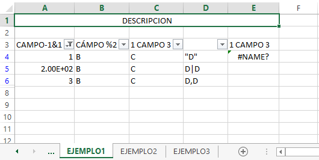
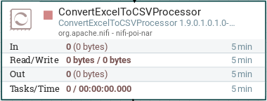
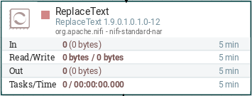
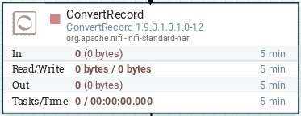
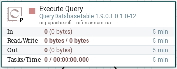

<a name="main"></a>  

----

# Procesamiento de Fuentes en NIFI

Las fuentes de ingestion que se procesan mediante la herramienta NIFI se almacenan de la siguiente manera:

 * __[Archivos XLSX](#xlsx)__
 * __[Archivos CSV](#csv)__
 * __[Base de datos (Relacional)](#bd)__ 

Cada formato requiere del manejo de ciertos procesadores en NIFI y algunas expresiones regulares que podran ayudar a obtener un esquema de datos mas solido y definido para el proceso de ingestion al HDFS.

## <a name="xlsx"></a> Archivos XLSX

Para el procesamiento de archivos excel se tiene que tomar los siguientes problemas comunes que se han encontrado al analizar y al ingestar los archivos los cuales son los siguientes:

1.  Espacios dentro de las cabeceras del excel.
2.  Caracteres especiales dentro del nombre de las columnas del excel.
3.  Los nombres de las columnas del excel inician con un número.
4.  El nombre de la columna viene completamente vacio pero trae datos.
5.  El archivo excel viene filtrado por algunas columnas.
6.  La información en el excel empieza desde la fila 2 o mas segun sea el caso.
7.  El contenido de la información contiene una comilla o doble comilla.
8.  El archivo contiene el nombre de las columnas repetidas.
9.  En el nombre de las columnas no debe tener ninguna letra acentuada.
10. Algunas celdas del excel tiene funciones en lugar de datos
11. El archivo excel contiene hojas de cálculo ocultas.
12. Algunos valores numericos vienen en el excel de forma exponencial.  

Los casos se ilustran en la siguiente imagen:



La solución encontrada para resolver estos problemas son el uso de los siguientes procesadores.

* __ConvertExcelToCSVProcessor__



Este procesador nos permite leer y convertir el archivo excel en un formato csv. 
Con este procesador se resuelven los siguientes puntos: __4, 5, 6, 10, 11__.
Para mas información revisar la siguiente documentacion del procesador de excel __[aqui](https://nifi.apache.org/docs/nifi-docs/components/org.apache.nifi/nifi-poi-nar/1.5.0/org.apache.nifi.processors.poi.ConvertExcelToCSVProcessor)__

* __ReplaceText__



Este procesador nos permite ejecutar expresiones regulares para la estandarizacion del esquema.
Con este procesador se resuelven los siguientes puntos: __1, 2, 3, 7, 8, 9__
Para mas información revisar la siguiente documentacion del procesador  __[aqui](https://nifi.apache.org/docs/nifi-docs/components/org.apache.nifi/nifi-standard-nar/1.5.0/org.apache.nifi.processors.standard.ReplaceText/)__

El punto número __12__ se resuelve con el procesador personalizado que se realizo para tratar algunos excel el cual esta aqui __[NIFICustomProcessorXLSX](./data-engineering/data-ingestion/Globales/NIFICustomProcessorXLSX/README.md)__

### Referencia de flujo con archivos XLSX

* [Gestores NETCM](./data-engineering/data-ingestion/NETCM/README.md)
* [Gestores BLAULABS](./data-engineering/data-ingestion/Almacen/README.md)
* [Almacen Segregación](./data-engineering/data-ingestion/Almacen/README.md)
* [CIP](./data-engineering/data-ingestion/CIP/README.md)
* [TELLABS](./data-engineering/data-ingestion/TELLABS/README.md)
* [ALCATEL](./data-engineering/data-ingestion/ALCATEL/README.md)
* [EPT MANAGER](./data-engineering/data-ingestion/EPT_MANAGER/README.md)

## <a name="csv"></a> Archivos CSV

Para el procesamiento de archivos excel se tiene que tomar los siguientes problemas comunes que se han encontrado al analizar y al ingestar los archivos los cuales son los siguientes:

1.  Espacios dentro del esquema del archivo, ejemplo: ```","Serial Number","```
2.  Caracteres especiales dentro del esquema del archivo: ```#~!¡¿?:;-\/*+><&%$()[]```
3.  Los nombres de las columnas inician con un numero, ejemplo: ```","0 - Serial Number","```
4.  El nombre de la columna viene vacio: ```","","```
5.  El contenido de la información contiene una comilla o doble comilla: ```,"20191231 "GMT"",```
6.  En el nombre de las columnas no debe tener ninguna letra acentuada: ```áéíóúÁÉÍÓÚ```
7.  El contenido de la columna contiene el delimitador del archivo: ```","December, 2019","```

* __ConvertRecord__



Este procesador nos permite leer el archivo csv y escribirlo en csv pero con el delimitador de eleccion y con doble comilla si se requiere. 
Para mas información revisar la siguiente documentacion del procesador convert record __[aqui](https://nifi.apache.org/docs/nifi-docs/components/org.apache.nifi/nifi-standard-nar/1.6.0/org.apache.nifi.processors.standard.ConvertRecord/index.html)__

* __ReplaceText__


Este procesador nos permite ejecutar expresiones regulares para la estandarizacion del esquema.
Con este procesador se resuelven los siguientes puntos: __1, 2, 3, 4, 5, 6__
Para mas información revisar la siguiente documentacion del procesador replace text  __[aqui](https://nifi.apache.org/docs/nifi-docs/components/org.apache.nifi/nifi-standard-nar/1.5.0/org.apache.nifi.processors.standard.ReplaceText/)__

### Referencia de flujo con archivos XLSX

* [Activo Fijo](./data-engineering/data-ingestion/ActivoFijo/README.md)
* [U2000 GPON](./data-engineering/data-ingestion/GPON/README.md)
* [U2000 FBB TX](./data-engineering/data-ingestion/FBBTX/README.md)
* [Gestores CIENA](./data-engineering/data-ingestion/CIENA/README.md)
* [Gestores SOEM](./data-engineering/data-ingestion/SOEM/README.md)
* [Gestores SEDONA](./data-engineering/data-ingestion/SEDONA/README.md)
* [Gestores Prime Manager](./data-engineering/data-ingestion/PRIME_MANAGER/README.md)
* [Salida Almacen](./data-engineering/data-ingestion/SalidaAlmacen/README.md)
* [NAGIOS](./data-engineering/data-ingestion/NAGIOS/README.md)
* [CERAGON](./data-engineering/data-ingestion/CERAGON/README.md)

## <a name="bd"></a> Base de datos (Relacional)

Para el procesamiento de base de datos relacionales se utilizo el siguiente procesador para obtener la información en la base de datos.

* __QueryDatabaseTable__



Este procesador ejecuta un query sobre la base de datos relacional para obtener la informción correspondiente.
Para mas información revisar la siguiente documentacion del procesador replace text __[aqui](https://nifi.apache.org/docs/nifi-docs/components/org.apache.nifi/nifi-standard-nar/1.6.0/org.apache.nifi.processors.standard.QueryDatabaseTable/)__

### Referencia de flujo con Base de datos (Relacional)

* [PPM](./data-engineering/data-ingestion/PPM/README.md)


__[Ir a Inicio](#main)__

----